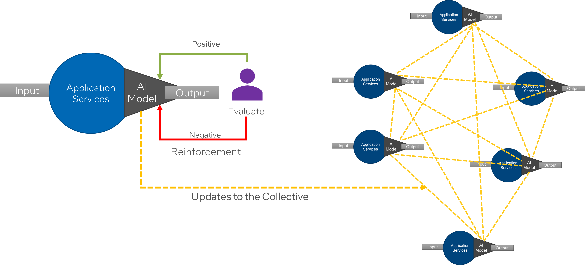

## Re-enforced Supervised Learning

Semi-supervised models - Some of the information is there at the beginning, but new data is being gathered during 
the execution of the SABRs. Some re-enforced learning part of the solution.

Re-enforced learn can use a voting mechanism. We contradictions are found then second level of features are
evaluated, third level features could also be used. Confidence levels should be part of the voting mechanism.
Adjusting weights and biases are part of the model. The individual that is doing the evaluation should be weighted
as well based on criteria from the customer. The weights and biases are used to resolve the conflict in results.

Confidence levels are improved over multiple epochs of the AI Model. The weights and biases are used to help resolve
conflicts.

Use the weights and biases to handle negative evaluators.

