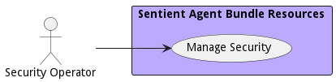

# Security Operator

The Security Operator is responsible for the implementation of security best practices and management of security operations like security key management, estalbishment of preventive, detectivetive and remediation services.

## Use Cases

* [Manage Security](usecase-ManageSecurity)

## User Interface
TBD

## Command Line Interface
* [ sabr security list](action--sabr-security-list) - Manage Security use case includes attestation of devices and services; prevention, detection, and remediation of cyber threats; and encryption and hash key management.
