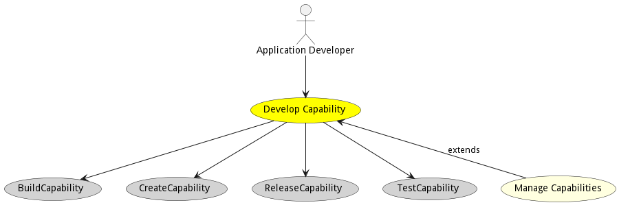
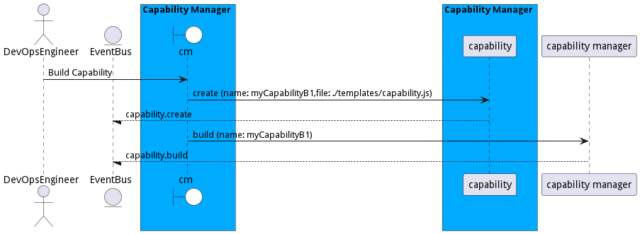
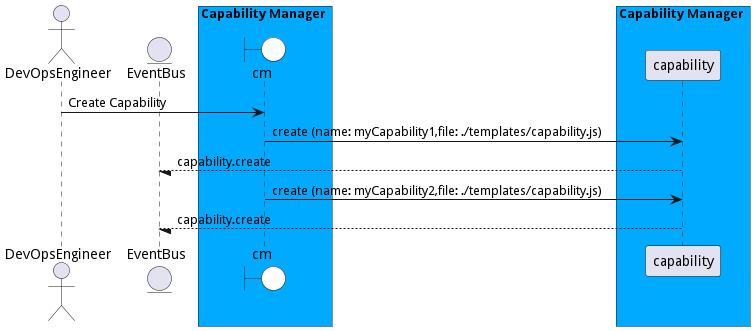
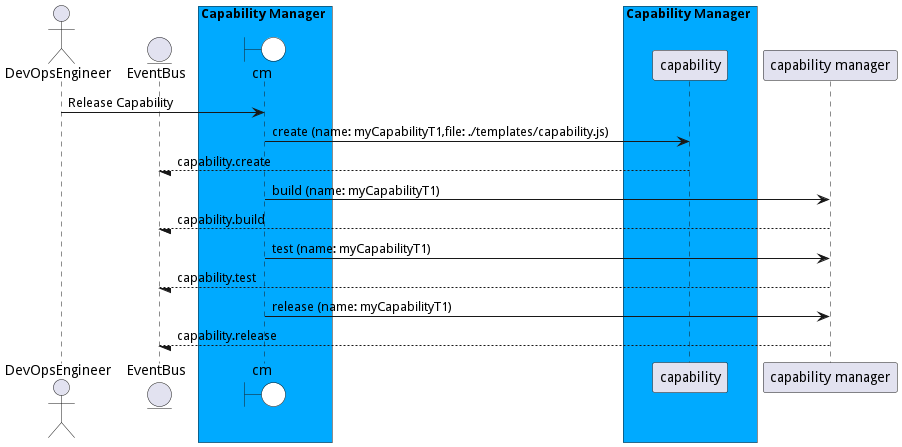
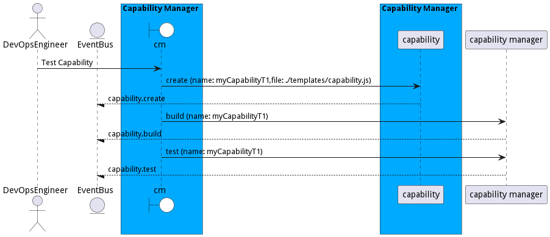

# Develop Capability

Develop Capability allows the application developer to develop a capability that contains multiple SABRs that working together to provide the capability.

## Actors

* [Application Developer](actor-applicationdeveloper)

## Extends Use Cases

* [Manage Capabilities](usecase-ManageCapabilities)

## Detail Scenarios

* [BuildCapability](#scenario-BuildCapability)
* [CreateCapability](#scenario-CreateCapability)
* [ReleaseCapability](#scenario-ReleaseCapability)
* [TestCapability](#scenario-TestCapability)

### Scenario Build Capability

Build capability allows a DevOps engineer to build a capability that gets deployed into the ecosystem.

#### Steps
1. [capability create --name myCapabilityB1 --file ./templates/capability.js](#action-capability-create)
1. [aml cm/capability/build --name myCapabilityB1](#action-aml-cm-capability-build)

#### Actors

* [DevOps Engineer](actor-devops)

### Scenario Create Capability

Create Capability allows for a capability to be created in the ecosystem. A capability contains a set of SABRs that work together to provide specific solutions in the ecosystem.

#### Steps
1. [capability create --name myCapability1 --file ./templates/capability.js](#action-capability-create)
1. [capability create --name myCapability2 --file ./templates/capability.js](#action-capability-create)

#### Actors

* [DevOps Engineer](actor-devops)

### Scenario Release Capability

Release Capability allows a capability to be released which includes creating a package that contains a sat of signed and certified SABRs that talk to each other to deliver capabilities to the ecosystem. When the capability is released it contains a hash that can be checked when deployed.

#### Steps
1. [capability create --name myCapabilityT1 --file ./templates/capability.js](#action-capability-create)
1. [aml cm/capability/build --name myCapabilityT1](#action-aml-cm-capability-build)
1. [aml cm/capability/test --name myCapabilityT1](#action-aml-cm-capability-test)
1. [aml cm/capability/release --name myCapabilityT1](#action-aml-cm-capability-release)

#### Actors

* [DevOps Engineer](actor-devops)

### Scenario Test Capability

Test Capability allows DevOps Engineers to test a capability before it is released. This is part of the DevSecOps process.

#### Steps
1. [capability create --name myCapabilityT1 --file ./templates/capability.js](#action-capability-create)
1. [aml cm/capability/build --name myCapabilityT1](#action-aml-cm-capability-build)
1. [aml cm/capability/test --name myCapabilityT1](#action-aml-cm-capability-test)

#### Actors

* [DevOps Engineer](actor-devops)

