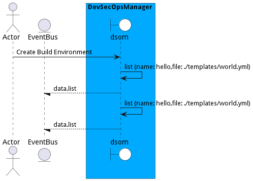

# Manage Environments

Manage Environments is the description

## Actors

* [Actor](actor-actor)

## Detail Scenarios

* [CreateBuildEnvironment](#scenario-CreateBuildEnvironment)

### Scenario Create Build Environment

Create Build Environment is the description

#### Steps
1. [data list --name hello --file ./templates/world.yml](#action-data-list)
1. [data list --name hello --file ./templates/world.yml](#action-data-list)

#### Actors

* [Actor](actor-actor)

