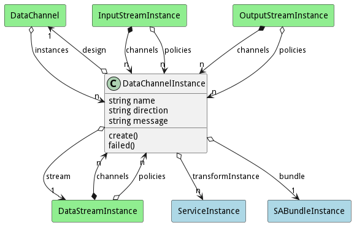
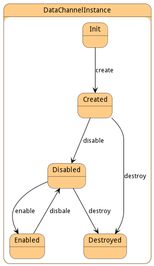

# DataChannelInstance

Data Channel Instance represents the connection of the services to the channel at the edge

## Attributes

* name:string - Name of the data channel instance
* direction:string - 
* message:string - Message string from the failed state.

## Associations

| Name | Cardinality | Class | Composition | Owner | Description |
| --- | --- | --- | --- | --- | --- |
| design | 1 | DataChannel |  |  | Parent of the channel Instance. This is the definition of the channel. |
| stream | 1 | DataStreamInstance |  |  | This is the stream instance that is running the channel |
| transformInstance | n | ServiceInstance |  |  | This is the instance of the transformation Service for the channel. |
| bundle | 1 | SABundleInstance |  |  | This is the sabr instance |

## Users of the Model

| Name | Cardinality | Class | Composition | Owner | Description |
| --- | --- | --- | --- | --- | --- |
| instances | n | DataChannel |  |  | This is a collection of all of the instances of the data channel running in the system. |
| channels | n | DataStreamInstance | true | true | This is the collection of channel instances that are attached to this data stream |
| policies | n | DataStreamInstance |  | false | This is the list of policies that are controlling the channels of the stream. They can come from the DataStream, the Resource, or the system overall. |
| channels | n | InputStreamInstance | true | true | This is the collection of channel instances that are attached to this data stream |
| policies | n | InputStreamInstance |  | false | This is the list of policies that are controlling the channels of the stream. They can come from the DataStream, the Resource, or the system overall. |
| channels | n | OutputStreamInstance | true | true | This is the collection of channel instances that are attached to this data stream |
| policies | n | OutputStreamInstance |  | false | This is the list of policies that are controlling the channels of the stream. They can come from the DataStream, the Resource, or the system overall. |

## State Net
The DataChannelInstance has a state net corresponding to instances of the class. Each state transistion will emit an 
event that can be caught with a websocket client. The name of the event is the name of the state in all lower case.
The following diagram is the state net for this class.

| Name | Description | Events |
| --- | --- | --- |
| Init | Initial State | create-&gt;Created,  |
| Created | DataChannelInstance is created | disable-&gt;Disabled, destroy-&gt;Destroyed,  |
| Disabled | DataChannelInstance is disabled | enable-&gt;Enabled, destroy-&gt;Destroyed,  |
| Enabled | DataChannelInstance is Enabled | disbale-&gt;Disabled,  |
| Destroyed | DataChannelInstance is destroyed |  |

## Methods
* [create() - Create a Data Channel Instance](#action-create)
* [failed() - Deployment Failed on the Data Channel Instance.](#action-failed)

<h2>Method Details</h2>
    
### Action datachannelinstance create

* REST - datachannelinstance/create?name=string&amp;file=YAML
* bin - datachannelinstance create --name string --file YAML
* js - datachannelinstance.create({ name:string,file:YAML })

#### Description
Create a Data Channel Instance

#### Parameters

| Name | Type | Required | Description |
|---|---|---|---|
| name | string |true | name of the Sentient Agent Bundle |
| file | YAML |false | file with the definition |

### Action datachannelinstance failed

* REST - datachannelinstance/failed?message=string
* bin - datachannelinstance failed --message string
* js - datachannelinstance.failed({ message:string })

#### Description
Deployment Failed on the Data Channel Instance.

#### Parameters

| Name | Type | Required | Description |
|---|---|---|---|
| message | string |true | Failed Message for the deployment error. |

