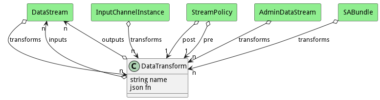

# DataTransform

Data Transformation taking inputs and producing to outputs.

## Attributes

* name:string - Name of the transformation
* fn:json - Function to run. This should have two parameters. (data,channel)

## Associations

| Name | Cardinality | Class | Composition | Owner | Description |
| --- | --- | --- | --- | --- | --- |
| inputs | n | DataStream |  |  | Inputs of the transformation. |
| outputs | n | DataStream |  |  | Outputs of the transformation. |

## Users of the Model

| Name | Cardinality | Class | Composition | Owner | Description |
| --- | --- | --- | --- | --- | --- |
| transforms | n | DataStream |  |  | This is the transformation that is called on data arriving to the Data Stream. |
| transforms | n | InputChannelInstance |  |  | Transformations to process when data arrives in this channel. |
| post | 1 | StreamPolicy |  |  | This is the transform to run after all of the transformation and before sending out. |
| pre | 1 | StreamPolicy |  |  | This is the transform to run after all of the transformation and before sending out. |
| transforms | n | AdminDataStream |  |  | This is the transformation that is called on data arriving to the Data Stream. |
| transforms | n | SABundle |  |  | Data Transformations run on input data send to output data. |

## Methods

<h2>Method Details</h2>
    

