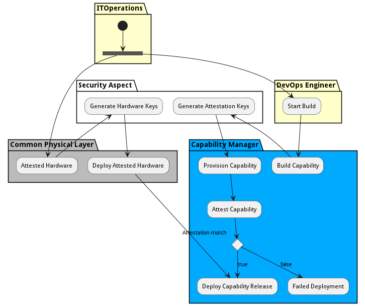

# Attest SABR to Device

Attest SABR to Device description needs to be completed.

## Activities

* Init - Initial state for the workflow
* Attested Hardware - Hardware attestation tags are created and stored in hardware protected memory TPM, SGX, or TDX
* Generate Hardware Keys - Generate attestation key for the hardware.
* Deploy Attested Hardware - Deploy the attested hardware
* Start Build - Build capability to be deployed to the hardware.
* [Build Capability](scenario-BuildCapability) - Build capability to be deployed to the hardware.
* Generate Attestation Keys - The attestation of the capability is tied to specific hardware tags of attested hardware
* Provision Capability - Build capability to be deployed to the hardware.
* Attest Capability - Attest Capability before the deploy
* [Deploy Capability Release](scenario-DeployCapabilityRelease) - The Attested Capability is deployed on the hardware its SABRs have been attested.
* Failed Deployment - The Capability could not be deployed because there were no devices attested.
