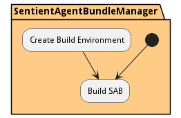

# Build SABR Process

Build and Encrypt a SABR from a SABR definition. This should include all images and packages required to run the SABR.

## Activities

* Init - Initial state for the workflow
* [Build SAB](scenario-BuildSAB) - This is the good flow!
* [Create Build Environment](scenario-CreateBuildEnvironment) - Create the build environment to package and encrypt the SABR bundle
