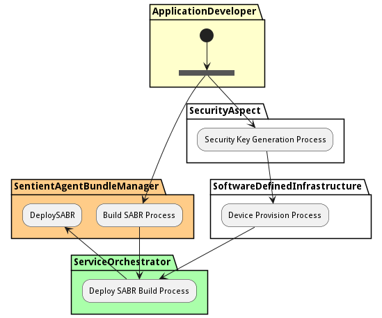

# SABR Deployment Process

Deploy a SABR to a device on the Edge. This includes managing the security keys and hashes in the attestation of the device and the deployment of the SABR on the Device.

## Activities

* Init - Initial state for the workflow
* [Build SABR Process](workflow-BuildSABRProcess) - Build the SABR from the SABM definition and encrypt the bundle.
* [Security Key Generation Process](workflow-SecurityKeyGenerationProcess) - Generate security keys so they can be used for the provisioning, encryption and decryption of the SAB builds.
* [Device Provision Process](workflow-DeviceProvisionProcess) - Provision a device so that it has the appropriate keys to work the Builds to decypt. This should also include attestation.
* Deploy SABR Build Process - Deploy the SABR Build to the attested device
* [DeploySABR](scenario-DeploySABR) - The SABR is up and running
