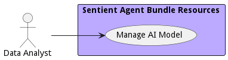

# Data Analyst

Uses Data solutions produced by the Data Scientist and Data Engineer to provide business value to the organization.

## Use Cases

* [Manage AI Model](usecase-ManageAIModel)

## User Interface
TBD

## Command Line Interface
* [ sabr aimodel list](action--sabr-aimodel-list) - Manage AI Model allows the data users to create, destroy, and update models, version control them and deploy them in the system.

