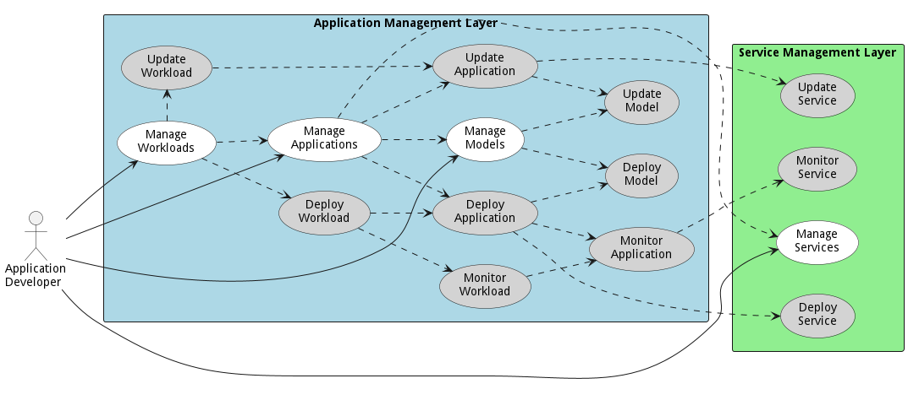

{#actor-function toLowerCase() { [native code] }}

# Application Developer

The Application Developer work in coordination with DevOps to manage services, applications and workloads through the development pipeline.

The Application Developer work in coordination with [DevOps](/doc/actor/devops) to  
manage services, applications and workloads through the development pipeline

## Use Cases

* [Integrate Learning](usecase-IntegrateLearning)
* [Manage Application](usecase-ManageApplication)
* [Develop Capability](usecase-DevelopCapability)

## User Interface
TBD

## Command Line Interface
* [ sabr aml am application/list](action--sabr-aml-am-application-list) - Integrate Learning allows application developers to integrate learnings from the AI algorithms into applications. This allows the insight gained from the AI models to be used to aid the tactical operator, helps an application run more effectively, or provide information to a high level orchestrator.
* [ sabr aml am application/list](action--sabr-aml-am-application-list) - Manage Applications in the system. Including deploying, and updating
* [ sabr aml cm capability/list](action--sabr-aml-cm-capability-list) - Develop Capability is the description

