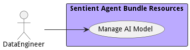

{#actor-function toLowerCase() { [native code] }}

# DataEngineer

Responsible for operationalization of data pipeline and the automation and deployment of data solutions. They work closely with the Data Scientist to deliver solutions to data analyst.

## Use Cases

* [Manage AI Model](usecase-ManageAIModel)

## User Interface
TBD

## Command Line Interface
* [ sabr aimodel list](action--sabr-aimodel-list) - Manage AI Model allows the data users to create, destroy, and update models, version control them and deploy them in the system.

