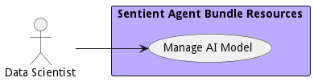

# Data Scientist

Responsible for the architecture and development of data analytic models and solutions. They work closely with the Data engineer to deliver solutions to the Data Analyst.

## Use Cases

* [Manage AI Model](usecase-ManageAIModel)

## User Interface
TBD

## Command Line Interface
* [ sabr aimodel list](action--sabr-aimodel-list) - Manage AI Model allows the data users to create, destroy, and update models, version control them and deploy them in the system.
