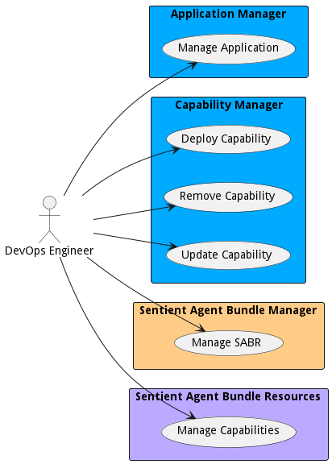

# DevOps Engineer

Responsible for the management of the automation of the delivery of applications and solutions in the organization. Works closesly with the IT Operators

## Use Cases

* [Manage Application](usecase-ManageApplication)
* [Deploy Capability](usecase-DeployCapability)
* [Remove Capability](usecase-RemoveCapability)
* [Update Capability](usecase-UpdateCapability)
* [Manage SABR](usecase-ManageSABR)
* [Manage Capabilities](usecase-ManageCapabilities)

## User Interface
TBD

## Command Line Interface
* [ sabr aml am application list](action--sabr-aml-am-application-list) - Manage Applications in the system. Including creating, deploying, and updating. Applications are primarily managed by DevOps engineers and developed by an application developer.
* [ sabr aml cm capability deploy](action--sabr-aml-cm-capability-deploy) - Deploy a capability into the ecosystem. This should deploy all of the SABRs in the capability or attach to currently running SABRs in the defined capabiility.
* [ sabr aml cm capability remove](action--sabr-aml-cm-capability-remove) - Remove Capability allows a DevOps Engineer to remove a capability from the ecosystem. This will remove all SABRs controlled and managed by the capability. It will not remove SABRs that are used by other Capabilties.
* [ sabr aml cm capability update](action--sabr-aml-cm-capability-update) - Update Capability allows a DevOps Engineer to update a capability in the ecosystem. This might include updating configurations, updating SABRs, removing SABRs, or adding SABRs to and existing capability.
* [ sabr diml sabm sabundle list](action--sabr-diml-sabm-sabundle-list) - Manage SABR allows the devops engineers to create,deploy, updated and destroy SABRs in the system.
* [ sabr capability list](action--sabr-capability-list) - Manage Capabilities use cases gives DevOps Engineers and IT Operations the ability to deploy and manage new capabilities in the system. A capability can be a set of workflows or applications that when working together provide value to the tactical operator.
