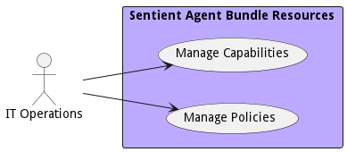

{#actor-function toLowerCase() { [native code] }}

# IT Operations

Responsible for the management of the infrastructure.

## Use Cases

* [Manage Capabilities](usecase-ManageCapabilities)
* [Manage Policies](usecase-ManagePolicies)

## User Interface
TBD

## Command Line Interface
* [ sabr capability list](action--sabr-capability-list) - Manage Capabilities use cases gives DevOps Engineers and IT Operations the ability to deploy and manage new capabilities in the system. A capability can be a set of workflows or applications that when working together provide value to the tactical operator.
* [ sabr policy list](action--sabr-policy-list) - Manage Policies use case includes establishing and managing DDIL environment policies for the complete ecosystem, individual capabilities, SABRs, and applications. This use case also refers to orchestration and deployment policies.

