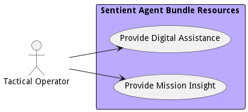

# Tactical Operator

The tactical operator is the end user of the digital assistance given from the AI models processing and developing insight from the data generated in the ecosystem.

## Use Cases

* [Provide Digital Assistance](usecase-ProvideDigitalAssistance)
* [Provide Mission Insight](usecase-ProvideMissionInsight)

## User Interface
TBD

## Command Line Interface
* [ sabr capability list](action--sabr-capability-list) - Provide Digital Assistance use cases provides curated and decision making information to the tactical operator. This could include suggestions to perform work, alerts to changing conditions, or automation of repetitive tasks.
* [ sabr capability list](action--sabr-capability-list) - Provide Mission Insight use cases analyses the data on the edge and in the data center to provide insight to business and mission problems through data analytics techniques

