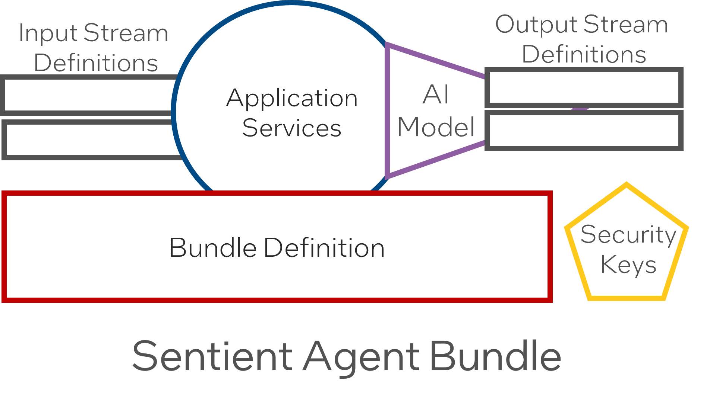
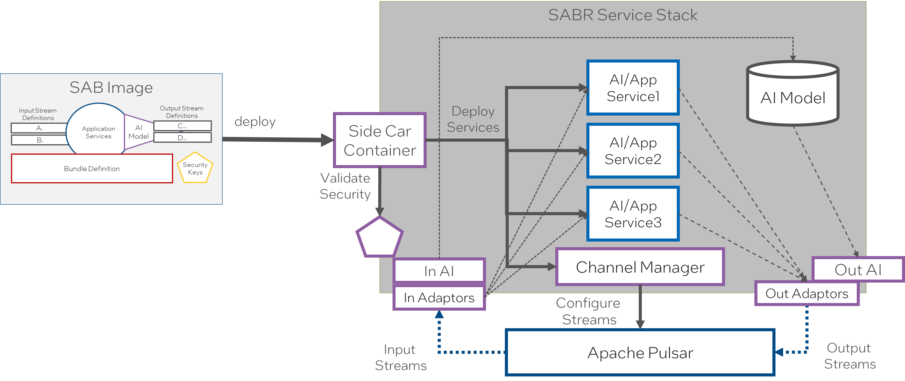
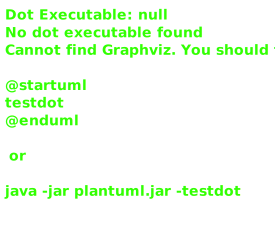
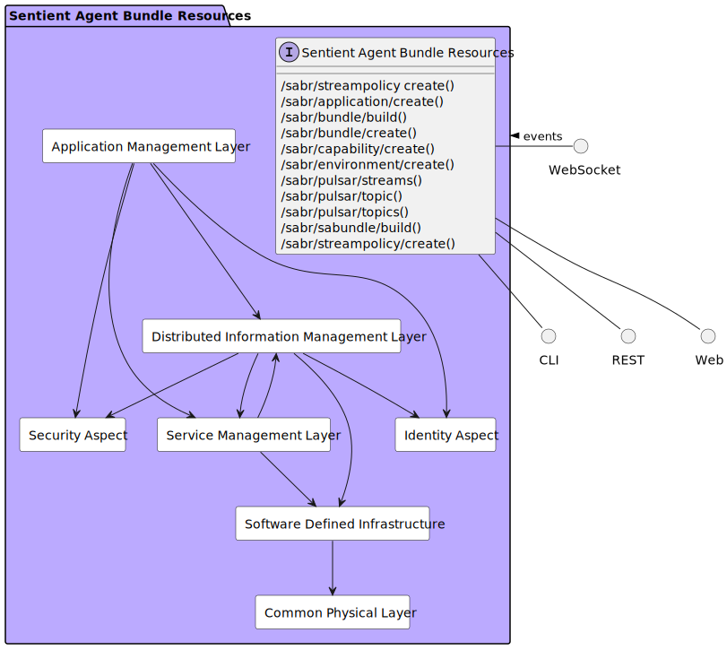

{# topPackage.name.toLowerCase()-project}

# Sentient Agent Bundle Resources

# Concepts
## Data Stream Concept
* The combination of the producer, the topic and the consumers comprises a Data Stream.
* Data transfer through Data Streams uses a publish and subscribe (PubSub) framework.
* A Data Stream is created when a producer (a service on a server) publishes data to a topic.
* One or more consumers subscribe to a topic and are notified when data is published.
* A consumer can also choose to only consume data when a specific event occurs in a Data Stream.
* If a DDG cannot radiate, a producer will cache the data and, when re-connected, publish data on the topic again.

## Sentient Agent Bundle
* Sentient Agent Bundle Resources (Agent Bundle) manage transformation algorithms, data stream definitions and 
interactions between systems.
* The container ecosystem (including Docker and Kubernetes) and DevOps environments (Red Hat OpenShift and Jenk ins),
build and distribute SABRs to Docker swarms and K8s clusters.
* The combination of all executables (applications and services), configuration files, stream definitions and data 
schemas, and transformation algorithms is called an Sentient Agent Bundle Definition (SABD).
* An SABD is represented as one container image in the Docker and K8s ecosystem and is deployed to a processor to 
bring it into the Learning Corpus mesh architecture.
* A security hash is added to the security keys in the Package and used to notarize the container image in a 
deployment repository.

## SABR Details
* The Stream Manager creates the channels for each stream and monitors the streams.
* An Learning Stream is created to connect to the learning corpus. Input and Output.
* For each stream definition there are channels created for each mode of operation.
** Example: Historical, Summary, Realtime
* Modes of operation are defined for all the applications and the stream manager handles which channels to use 
during different modes of operation.
* Streams are encrypted and decrypted using hashes in the security keys.

## SABR Deployment

A SABR container contains the stream definitions, security keys, application definitions, AI 
models and transformation algorithms. When it is deployed it explodes the configuration and deploys as many 
containers as needed to run the SABR and configures the data stream manager to handle the streams and channels based 
on the policies of the system. All communication to and from the application happens through the channels 
established in the stream manager.

## SABR Logical Architecture
The SABR is an instantiation of the Edgemere Architecture and maps directly on top of the Edgemere Architecture. Not 
all of the elements of Edgemere are required for the SABR architecture. Assumptions that a SDI and Physical layer 
are already established in the solution are made. The following diagram shows the subsystem specific to the SABR 
architecture.

* [Application Manager](package--sabr-aml-am) – Responsible for the management (development, test and deployment) of
  applications in the solution
* [Capability Manager](package--sabr-aml-cm) – Responsible for the deployment and management of capabilities in the 
  ecosystem, including the deployments of multiple SABRs.
* [Data Stream Manager](package--sabr-diml-dsm) – Responsible for the deploying, monitoring, and provisioning of data 
  streams in the ecosystem. 
* [Learning Corpus](package--sabr-aml-lc) – Responsible for the management of AI learning algorithms, their updates, 
and deployments.
* [Security Aspect](package--sabr-sa) – Gives a common security model across the subsystems of the solution.
* [Sentient Agent Bundle Manager](package--sabr-diml-sabm) – Gives the ability to bundle datastreams, ai algorithms and 
operating in a heterogeneous environment.
* [Service Orchestrator](package--sabr-sml-so) – Responsible for the deployment and managment of services in the 
ecosystem.

# Actors

There are several users of the system. We first took a use case analysis approach to the architecture. First,
identifying the actors/users of the system and building out how the actor uses the system? What their key objectives and
goals are? and How they use the system? This list is not an exhaustive list of all actors of the system but are the
primary actors.

* [AIDeveloper](actor-aideveloper)
  
* [DevOpsEngineer](actor-devopsengineer)
  
* [SoftwareDeveloper](actor-softwaredeveloper)
  
* [SoftwareEngineer](actor-softwareengineer)
  
* [SystemAdmin](actor-systemadmin)
  
* [TacticalOperator](actor-tacticaloperator)
  

These actors are found in most organizations and there are several different organizational structures that can be
employed. The key is to identify the people or organization that fits the different actors in the systems. The following
is an example of a centralized organizational structure of the actors of the system.

# UseCases

* [Manage Application](usecase-ManageApplication)
  
* [Deploy Capability](usecase-DeployCapability)
  
* [Develop Capability](usecase-DevelopCapability)
  
* [Remove Capbility](usecase-RemoveCapbility)
  
* [Update Capbility](usecase-UpdateCapbility)
  
* [Manage SABR](usecase-ManageSABR)
  
* [Find Enemy Combatant](usecase-FindEnemyCombatant)
  
* [Manage AI Model](usecase-ManageAIModel)
  
* [Manage Capabilities](usecase-ManageCapabilities)
  
* [Manage Capbilities](usecase-ManageCapbilities)
  

# Solution Architecture

The Data Model for the  Sentient Agent Bundle Resources shows how the different objects and classes of object interact and their
structure.

* [Application Management Layer](package--sabr-aml)
  
* [Common Physical Layer](package--sabr-cpl)
  
* [Distributed Information Management Layer](package--sabr-diml)
  
* [Identity Aspect](package--sabr-ia)
  
* [Security Aspect](package--sabr-sa)
  
* [Service Management Layer](package--sabr-sml)
  
* [Software Defined Infrastructure](package--sabr-sdi)
  

## Deployment Architecture

This subsystem is deployed using micro-services as shown in the diagram below. A nodejs app is used to implement the
micro-services in the system. Each subsystem also has an CLI, REST and Web Interface exposed through a nodejs
application. The nodejs application will interface with the micro-services and can monitor and drive work-flows through
the mesh of micro-services.

The solution can be deployed on different environments. The standard environments in the architecture are local, dev,
test, and prod. These environments fit into the typical devops pipelines that exist in the industry. Additional
deployment environments can be added to fit the needs of the user.

## Physical Architecture

The Sentient Agent Bundle Resources architecture is physically laid out on a hybrid cloud infrastructure using a microservice
architecture. All of the micro-services communicate to each other and the main app through a REST interface. A CLI, REST
or Web interface is available for external systems or users to interact with the system. Each subsystem in the
architecture uses an aggregated service/stack pattern that allows for the elasticity of services based on the workloads,
capacity and business rules established for the solution. See each subsytem for more information on the individual
stacks and their services.

## Deployment Architecture

This subsystem is deployed using micro-services as shown in the diagram below. The 'micro' module is used to implement
the micro-services in the system. The subsystem also has an CLI, REST and Web Interface exposed through a nodejs
application. The nodejs application will interface with the micro-services and can monitor and drive work-flows through
the mesh of micro-services.

