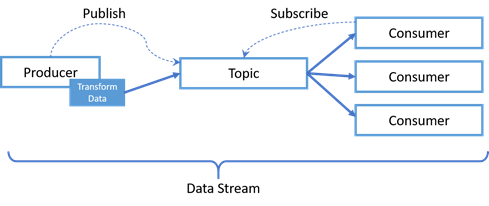
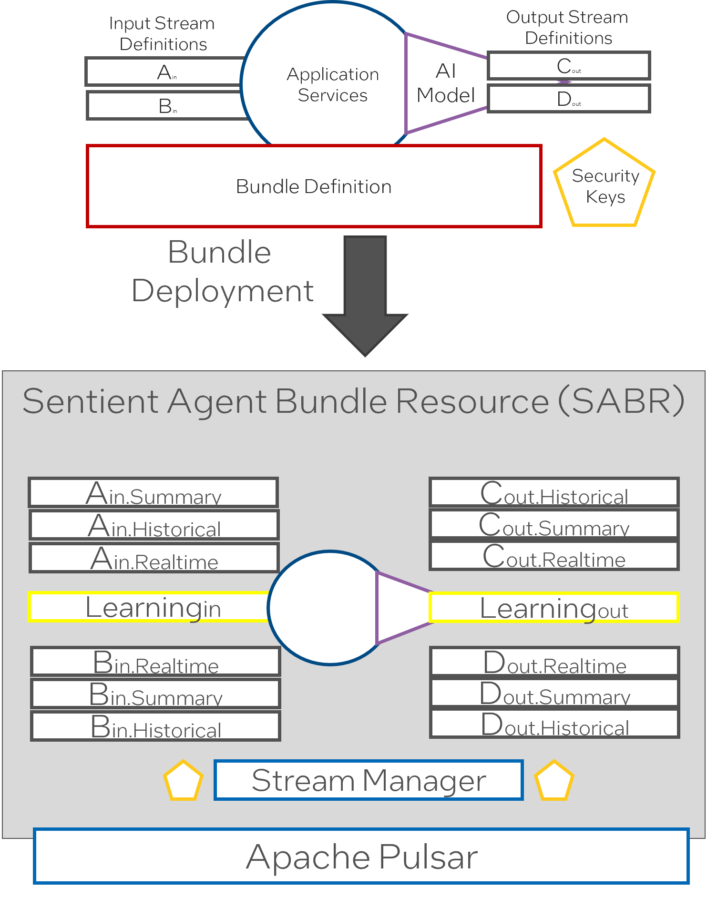
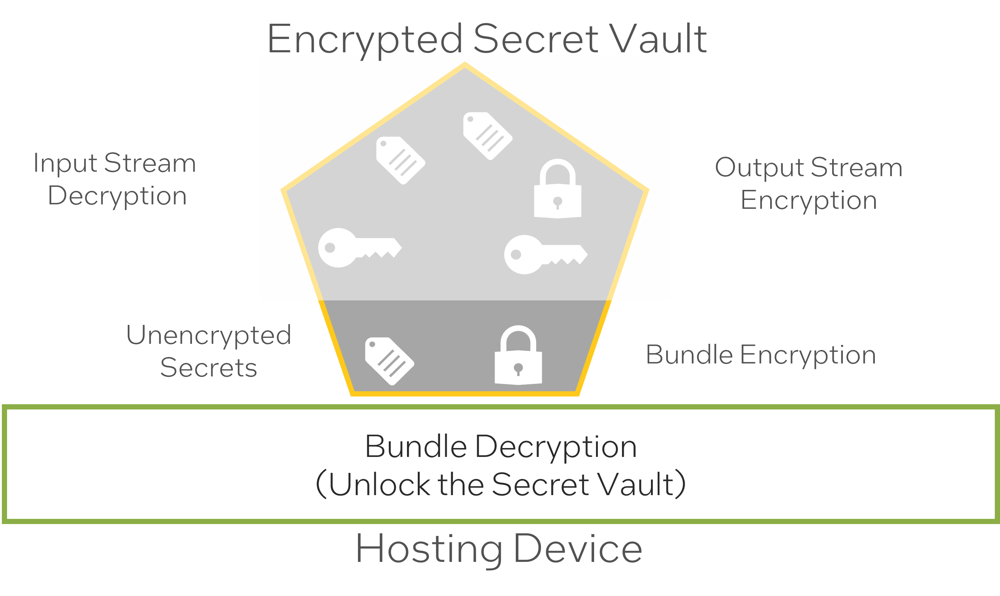
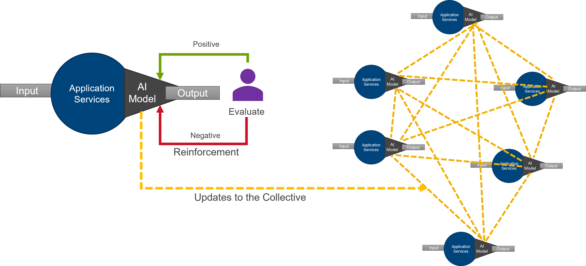
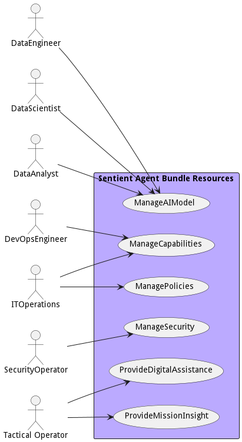
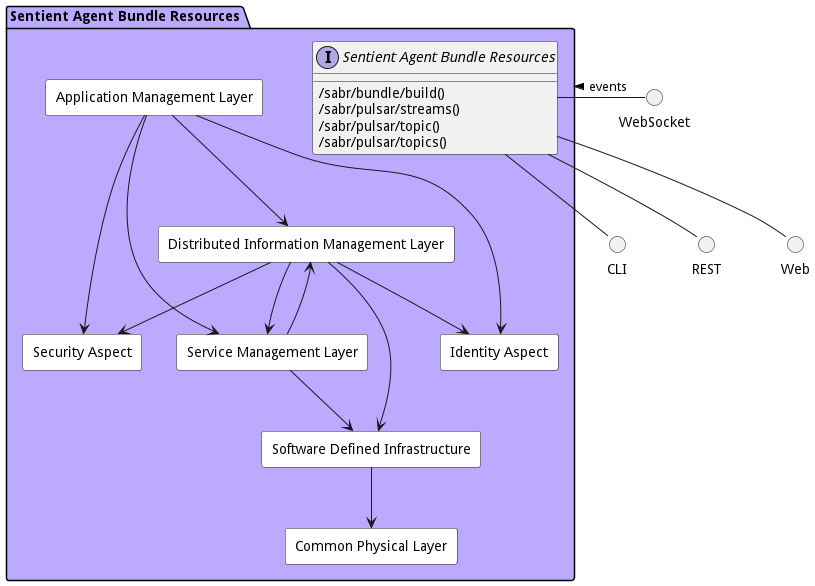

# Introduction

As edge devices become more capable to process data at the edge--including AI inference, data normalizations,
encryption, and compression—organizations are looking at new operating models to drive decision-making closer to where
data is generated and collected. The objective of this white paper is to articulate the architecture and design of a
distributed data stream framework utilized to process large volumes of data across a heterogeneous semi-connected
ecosystem of edge devices, named sentient agent bundle resources (SABR).

# Problem Statement

Edge Computing brings with it new challenges that solutions in the data center or the cloud only do not have. Many
organizations are faced with edge ecosystems that operating in a denied, degraded, intermittent, or limited (DDIL)
network environment requiring systems that can work autonomously when network connectivity is in question. Additionally,
problems with heterogeneous hardware and software platforms, large volume of data generation and movement, and physical
and cyber security make managing applications and devices at the edge complex. So complex that the industry as a whole
are behind the projected adoption of the edge computing.

Another technology with promises of opening up new use cases and unlocking data power to accelerate decision-making is
artificial intelligence (AI). Moving AI to the edge accelerates decision-making by decreasing the volume of data
movement, and moves decision-making close to data generation. Because of the heterogeneity of edge computing, AI models
are just as diverse as the types of edge devices. Organizations require a mechanism to manage heterogeneous AI models,
their data sources and approaches in a unified manner across a distributed ecosystem.

Organizations need a solution that provide:

* Security – Provides a hardware root of trust to match AI models with attested hardware to prevent AI models from
  working outside the attested ecosystem. Also prevents unverified and unattested models from running in the
  ecosystem.
* Manageability – AI models and algorithms are managed from a federated control plane that manages deployment, updates
  and decommissioning.
* Auditability – Changes to SAPRs, their AI models and algorithms are tracked from a single management framework that
  can be audited.
* Visibility – Operator awareness of SAPR health, AI model deployments and operational efficiency is enabled.
* Reliability – Because the Learning Corpus is distributed across the ecosystem, there is no single point of failure;
  operational availability is sustained.
* Resiliency – The SAPRs are designed to run in a DDIL environment; the Learning Corpus takes advantage of this built-in
  resiliency.
* Consistency – AI model consistency is essential in a mission critical distributed ecosystem. This approach manages AI
  model divergence by keeping track of SAPRs and AI models in use.
* Simplification – The framework provides resiliency, consistency, reliability and security that all AI algorithms
  require under DDIL conditions during Distributed Maritime Operations. This simplification enables AI developers to
  focus on the AI application, not on the complex environment.
* Scalability – System nodes can be added or removed easily without shutting down or reconfiguring the system. Streams
  and algorithms can also be easily scaled.

# Concepts

The Sentient Agent Bundle Resource (SABR) provides an architecture that utilizes well-known concepts and design patterns
to enable a resilient, easy-to-use architecture: the data stream concept, container bundling in DevSecOps , container
sidecar pattern, zero trust architecture, and reinforced collective learning.

## Data Stream Concept

The data stream is a mature concept that allows data to be passed between a producer and a set of consumers without
direct coupling between the entities. This concept provides the ability to deploy large numbers of producers and
consumers in the same ecosystem without the fragility of coupling. 

A data stream is created when a producer (a service on a server) publishes data to a topic. One or more consumers
subscribe to a topic and are notified when data is published to the topic. The combination of the producer, the topic
and the consumers create a data stream. Streams also contain a mechanism, called stream functions, to transform data
before it is published to the topic. These functions can also be utilized to identify event conditions and enable
controls on stream management to subscribers for capabilities such as access, routing, event driven alerts and data
prioritization. Data streams have the benefit of loosely coupling the producer and consumer through an abstraction
contained in the PubSub framework. This enables the producer and consumer to operate independent of each other. This is
beneficial during intermittent communication conditions since the consumer can continue to operate even when not
receiving data from the producer. Another benefit is the producer can cache data if required and send later. For
example, if a Submarine is operating at depth, the producer will cache the data and, when re-connected, publish data on
the topic again.

Before a producer publishes the data, it uses a transformation algorithm to simplify or aggregate the data. These
transformation algorithms can perform any number of functions, including normalization, temporal compression, AI object
detection, data aggregation and others. These transformations are invaluable to getting the most effective insight
information to the right consumers (decision makers) at the right time.

Managing these data streams, their interactions and transformation algorithms can be difficult without a common
framework. There are both open source and commercial stream managers available that can manage the data streams across
multiple locations, states of connectivity, and hardware platforms.

### Benefits

This concept provides several key benefits for the highly distributed semi-connected environment.

* Dynamic heterogeneous mesh configurations.
* One or more consumers can subscribe to a topic fostering reuse of common producers.
* A consumer can also choose only to consume data when a specific event occurs in a Data Stream.
* Resiliency when the network is down because a producer caches the data and, when re-connected, publish data on the
  topic again.

## Container Bundling in DevSecOps

Traditional DevSecOps pipeline push artifacts a development, build, test, and deploy pipeline that produces and
executable that is deployed into production environments. The container ecosystem has made the development of highly
portable executables a reality by building container images that can contain several artifacts required to
configuration, secure, and execute microservices in any environment.

In the case of data streams the DevSecOps pipeline is utilized to bundle the application, the AI Model or data
transformation configurations, and the input & output stream configurations. This bundling of all aspects of the data
stream provides a mechanism to deploy producers and consumers of data streams anywhere in the edge ecosystem containers
can be deployed. The name of these data transformation applications are sentient agent bundles
(SAB).

### Benefits

This concepts provides several vital benefits to deploy data streams across a distributed environment.

* Standard development and deployment of capabilities across a heterogeneous ecosystem.
* Portability of solutions from in the datacenter into the edge devices.
* Decreased bandwidth to deploy only changes to bundles.
* Speed to deploy capabilities into the ecosystem.

### Sentient Agent Bundle (Application Bundle)

The Sentient Agent Bundle (SAB) is an implementation of the container bundle pattern that contains all of the
information required to launch all of the microservices, stream definitions, and network configurations needed to run a
data transformation algorithm (transformation, ai, analytics) on any node in the ecosystem. The pattern allows a bundle
to be deployed on the edge, cloud, or data center securely. When a bundle has been verified and attested, it is
unpackaged and deployed to the target node, launching all of the microservices and connecting them to the underlying
stream management system.

* Sentient Agent Bundle Resources (Agent Bundle) manage transformation algorithms, data stream definitions, and
  interactions between systems.
* The container ecosystem (including Docker and Kubernetes) and DevOps environments (Red Hat OpenShift and Jenk ins)
  build and distribute SABRs to Docker swarms K8s clusters.
* The combination of all executables (applications and services), configuration files, stream definitions, data schemas,
  and transformation algorithms is called a Sentient Agent Bundle Definition (SABD).
* An SABD is represented as one container image in the Docker and K8s ecosystem and is deployed to a processor to bring
  it into the Learning Corpus mesh architecture.
* A security hash is added to the security keys in the Package and used to notarize the container image in a deployment
  repository.

## Container Sidecar Pattern

A sidecar container is a helper container that helps manage administrative, logging, audit, or security tasks. The
sidecar is typically a small container that does specific activities to support the main container. Many organizations
use sidecar containers to add consistent behavior across a heterogeneous containers like logging, audit, network
encryption, and security.

#### Sentient Agent Bundle Resource Details (SABR)

While a Sentient Agent Bundle(SAB) contains the definition of a sentient agent, a Sentient Agent Bundle Resources
(SABR) is a running instance of an intelligent agent. It includes all the resources that enable the sentient agent to
perform all the work designated for the agent. This includes evaluating the bundle against system policies for stream
and channel definitions, establishing security domains, and establishing managing streams named LearningIn and
LearningOut Streams for each bundle.

* The Stream Manager creates the channels for each stream and monitors the streams.
* An Learning Stream is created to connect to the learning corpus. Input and Output.
* For each stream definition, there are channels created for each mode of operation.
  ** Example: Historical, Summary, Realtime
* Modes of operation are defined for all the applications, and the stream manager handles which channels to use during
  different modes of operation.
* Streams are encrypted and decrypted using hashes in the security keys.

### SABR Deployment

A SABR container contains the stream definitions, security keys, application definitions, AI models, and transformation
algorithms. When a SABR is deployed, it explodes the configuration and deploys as many containers as needed to run the
SABR and configures the data stream manager to handle the streams and channels based on the system’s policies. All
communication to and from the application happens through the channels established in the stream manager.

In this case the side car container unpacks all the elements for the sentient agent including one or more microservices,
data volumes that includ AI Models, a stream manager micro-service, any input and output stream adaptors required to
convert stream data to be ingested by the intelligent agent services, and validates the security certifications to run
and decrypt data streams.

## Zero Trust Security

In order to secure the network of data streams a security vault is included in the SAB that contains keys, and hashes to
establish root of trust between the SABR and the hardware it is running, the consumers of data streams and the producers
of data streams.

There are four areas of that must be protected inorder to establish a zero trust architecture of data streams.

1. Prevent SABRs from running on untrusted edge devices. This prevents a bad actor from aqcuiring a SABR container and
   running it on their own hardware.
2. Prevent untrusted/spoofed SABRs from running on trusted hardware. This prevents bad actors from deploying SABRs into
   a protected ecosystem, causing havoc or stealing information.
3. Prevent publishing of untrusted data onto a data stream. All data stream data is encrypted with appropriate shared
   encryption keys and hashes.
4. Prevent receiving untrusted data from a data stream. Shared and private decryption keys and hashes are available to
   decrypt input data streams.
5. Prevent bad actors from listening into data streams. All data streams are encrypted. All decryption and encryption
   keys specific to the data stream definitions in the bundle are contained in the secret vault which is encrypted.
6. Authorization and access to the data streams is timebase and must be re-attested after the timeout.

The security keys contains two sections and encryption secret vault and an unencrypted security key section. When a SABR
is deployed to edge hardware the security keys in the unencrypted section are used to validate and decrypt the bundle
including the encrypted secret vault which should be stored in protected memory, not permenately on the device. The keys
and hashes stored in the encrypted secret vault decrypt and encrypt the input and output data streams.

## Reinforced Collective Learning

In highly dynamic environments, AI models need to change. As AI nodes interact with the real world and are guided by
human feedback, the AI models change and adapt to produce better outcomes. As this new information becomes available,
the ability to update AI models at the edge is critical. Sharing learnings through propagation of models changes is
critical in building a collective intelligent corpus that all edge nodes can leverage to perform their work. Propagating
changes to AI models across both static and dynamic training of AI models are essential to heterogeneous platforms that
include multiple edge and data center nodes.

Managing AI models in these types of environments is non-trivial and requires forethought and a robust system approach
that includes DevSecOps. This is exacerbated by the working environment of edge deployments, where thousands of devices
need to be updated with several dozen AI model updates in a continuous stream of updates. A systematic approach is
required to manage the complexity of accepting, validating and deploying dynamic and static AI model updates across the
vast ecosystem. The SABR architecture provides the foundational elements to effectively manage AI algorithms at the
edge.

The Learning Corpus is the intelligent, distributed repository of AI models. The Learning Corpus manages the AI models
and their updates and tracks which SAPRs are utilizing which AI model. As Sailors interact with systems like DCGS-N that
utilize the AI models, the AI algorithms can learn from model updates. These model updates are managed and validated in
the Learning Corpus, then distributed to the SAPRs in the ecosystem. This feedback loop is critical to controlling
inconsistencies in AI models in the distributed ecosystem.

# Solution

To enable a future-proof and expandable system, it is essential to understand how different parts of the system relate
to each other and establish isolation layers (through standard interfaces or abstractions). This isolation allows the
various subsystems in the solution to “grow” in parallel with minimal effect on each other. The SABR architecture should
not be the only data management architecture utilized in the system. Leveraging common architectural elements is
critical to developing a resilient and cost effective system. With the end goal in mind and the establishment of
interfaces between the sub-systems, new features for hardware or software can be added progressively toward the utopian
end state. This utopian architecture is known as the
[edgemere architecture](https://madajaju.github.io/edgemere).

This diagram shows how the different subsystems fit together. A quick understanding of each layer will expose the
responsibilities of each layer.

* [Application Layer](https://madajaju.github.io/edgemere/package--edgemere-aml) – Responsible for the management
  (development, test and deployment) of applications in the solution.
* [Distributed Information Management Layer](https://madajaju.github.io/edgemere/package--edgemere-diml) – Responsible
  for the management (curation, governance, lifecycle management, and tagging) of data across a heterogeneous
  infrastructure (Cloud, Data Center, Edge and Client).
* [Service Management Layer](https://madajaju.github.io/edgemere/package--edgemere-sml) – Responsible for the deploying,
  monitoring, and provisioning of services (containers)
  in the solution.
* [Software Defined Infrastructure](https://madajaju.github.io/edgemere/package--edgemere-sdi) – Responsible for the
  management (deploying, monitoring and provisioning) of infrastructure (Compute, Storage, Network, and Accelerators) in
  the solution.
* [Physical Layer](https://madajaju.github.io/edgemere/package--edgemere-cpl) – Responsible for the command, control and
  monitoring of the physical devices in the solution.
* [Security Aspect](https://madajaju.github.io/edgemere/package--edgemere-sa) – Gives a common security model across the
  subsystems of the solution.
* [Identity Aspect](https://madajaju.github.io/edgemere/package--edgemere-ia) – Give the ability to uniquely identify
  and attest identity of users, hardware, applications, services, and virtual resources.

## SABR Logical Architecture

The SABR architecture is an instantiation of the [Edgemere Architecture](https://madajaju.github.io/edgemere) and maps
directly on top of the [Edgemere Architecture](https://madajaju.github.io/edgemere). Not all elements of Edgemere are
required for the SABR architecture. Assumptions are made that an SDI and Physical layer are already established in the
solution. The following diagram shows the subsystem specific to the SABR architecture.

* [Application Manager](package--sabr-aml-am) – Responsible for the management (development, test and deployment) of
  applications in the solution.
* [Capability Manager](package--sabr-aml-cm) – Responsible for the deployment and management of capabilities in the
  ecosystem, including the deployments of multiple SABRs.
* [Data Stream Manager](package--sabr-diml-dsm) – Responsible for the deploying, monitoring, and provisioning of data
  streams in the ecosystem.
* [Learning Corpus](package--sabr-aml-lc) – Responsible for the management of AI learning algorithms, their updates, and
  deployments.
* [Security Aspect](package--sabr-sa) – Gives a common security model across the subsystems of the solution.
* [Sentient Agent Bundle Manager](package--sabr-diml-sabm) – Gives the ability to bundle data streams, ai algorithms and
  operating in a heterogeneous environment.
* [Service Orchestrator](package--sabr-sml-so) – Responsible for the deployment and management of services in the
  ecosystem.

## Benefits

One of the benefits of this architecture is applications can be developed in the data center and in a similar
environment as what runs on the edge. User acceptance, unit level, and burn-in testing can all be performed on systems
in the data center and then deployed in the field without variability in quality and operating. Because the Physical
Layer is abstracted from the applications, the applications freely move between the different hardware. This easily
lends itself to the portability of applications and capabilities and decreases the time to develop, test, and deploy
applications and services. Putting in place a modern DevOps stack in the Application Layer can dramatically increase the
deployment velocity. This also decreases the need for Digital Twin infrastructure and operations. Because the hardware
is shared between the Data Centers and On ship servers, the need to build a complete digital twin is no longer needed.
Only specialized hardware/application systems would need to be “mimicked (ed)” for digital twin.

# Sentient Agent Bundle Resources Details

The following section contains details of the high level architecture of the Sentient Agent Bundle Resources system. It is broken
into the actors of the system, the use cases of the system, and a high level architecture of the system including
physical and deployment strategies. Details of these elements can be found by following the links to the complete
architecture.

## Actors

There are several users of the system. We first took a use case analysis approach to the architecture. First,
identifying the actors/users of the system and building out how the actor uses the system? What their key objectives and
goals are? and How they use the system? This list is not an exhaustive list of all actors of the system but are the
primary actors.

* [ApplicationDeveloper](actor-applicationdeveloper) - The Application Developer work in coordination with DevOps to manage services, applications and workloads through the development pipeline.
  
* [DataAnalyst](actor-analyst) - Uses Data solutions produced by the Data Scientist and Data Engineer to provide business value to the organization.
  
* [DataEngineer](actor-dataengineer) - Responsible for operationalization of data pipeline and the automation and deployment of data solutions. They work closely with the Data Scientist to deliver solutions to data analyst.
  
* [DataScientist](actor-datascientist) - Responsible for the architecture and development of data analytic models and solutions. They work closely with the Data engineer to deliver solutions to the Data Analyst.
  
* [DataSteward](actor-datasteward) - Responsible for the governance of data in their organization. They implement policies established by the CDO.
  
* [DevOpsEngineer](actor-devops) - Responsible for the management of the automation of the delivery of applications and solutions in the organization. Works closesly with the IT Operators
  
* [ITOperations](actor-itops) - Responsible for the management of the infrastructure.
  
* [SecurityOperator](actor-secops) - The Security Operator is responsible for the implementation of security best practices and management of security operations like security key management, estalbishment of preventive, detectivetive and remediation services.
  
* [TacticalOperator](actor-tacticaloperator) - The tactical operator is the end user of the digital assistance given from the AI models processing and developing insight from the data generated in the ecosystem.
  

These actors are found in most organizations and there are several organizational structures that can be employed. The
key is to identify the people or organization that fits the different actors in the systems. The following is an example
of a centralized organizational structure of the actors of the system.

## UseCases

* [Manage AI Model](usecase-ManageAIModel) - Manage AI Model allows the data users to create, destroy, and update models, version control them and deploy them in the system.
  
* [Manage Capabilities](usecase-ManageCapabilities) - Manage Capabilities use cases gives DevOps Engineers and IT Operations the ability to deploy and manage new capabilities in the system. A capability can be a set of workflows or applications that when working together provide value to the tactical operator.
  
* [Manage Policies](usecase-ManagePolicies) - Manage Policies use case includes establishing and managing DDIL environment policies for the complete ecosystem, and orchestration and deployment policies.
  
* [Manage Security](usecase-ManageSecurity) - Manage Security use case includes prevention, detection, remediation and key management
  
* [Provide Digital Assistance](usecase-ProvideDigitalAssistance) - Provide Digital Assistance use cases provides curated and decision making information to the tactical operator. This could include suggestions to perform work, alerts to changing conditions, or automation of repetitive tasks.
  

## Solution Architecture

The Data Model for the  Sentient Agent Bundle Resources shows how the different objects and classes of object interact and their
structure.

* [Application Management Layer](package--sabr-aml) - <
  %- topPackage.subpackages[name].description 
  
* [Common Physical Layer](package--sabr-cpl) - <
  %- topPackage.subpackages[name].description 
  
* [Distributed Information Management Layer](package--sabr-diml) - <
  %- topPackage.subpackages[name].description 
  
* [Identity Aspect](package--sabr-ia) - <
  %- topPackage.subpackages[name].description 
  
* [Security Aspect](package--sabr-sa) - <
  %- topPackage.subpackages[name].description 
  
* [Service Management Layer](package--sabr-sml) - <
  %- topPackage.subpackages[name].description 
  
* [Software Defined Infrastructure](package--sabr-sdi) - <
  %- topPackage.subpackages[name].description 
  

### Deployment Architecture

This subsystem is deployed using microservices as shown in the diagram below. A nodejs app is used to implement the
microservices in the system. Each subsystem also has an CLI, REST and Web Interface exposed through a nodejs
application. Additionally, the subsystems handle events through a WebSocket interface. The nodejs application will
interface with the microservices and can monitor and drive work-flows through the mesh of microservices.

The solution can be deployed on different environments. The standard environments in the architecture are local, dev,
test, and prod. These environments fit into the typical devops pipelines that exist in the industry. Additional
deployment environments can be added to fit the needs of the user.

* [local](environment--sabr-local)
  
* [dev](environment--sabr-dev)
  
* [test](environment--sabr-test)
  
* [prod](environment--sabr-prod)
  

### Physical Architecture

The Sentient Agent Bundle Resources architecture is physically laid out on a hybrid cloud infrastructure using a microservice
architecture. All the microservices communicate to each other and the administrative app through a REST and Websocket
interface. A CLI, REST, Websocket and Web interface is available for external systems or users to interact with the
system. Each subsystem in the architecture uses an aggregated service/stack pattern that allows for the elasticity of
services based on the workloads, capacity and business rules established for the solution. See each subsystem for more
information on the individual stacks and their services.

* [local](environment--sabr-local)
  
* [dev](environment--sabr-dev)
  
* [test](environment--sabr-test)
  
* [prod](environment--sabr-prod)
  
