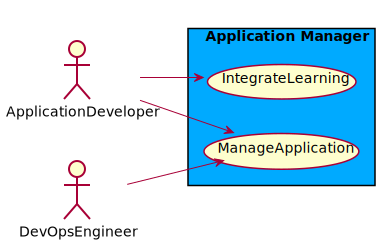
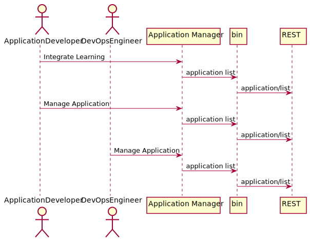
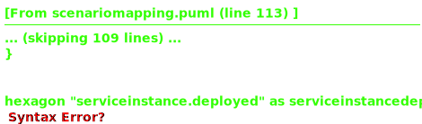
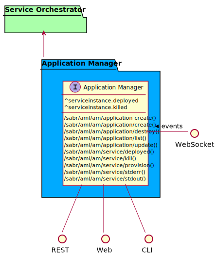
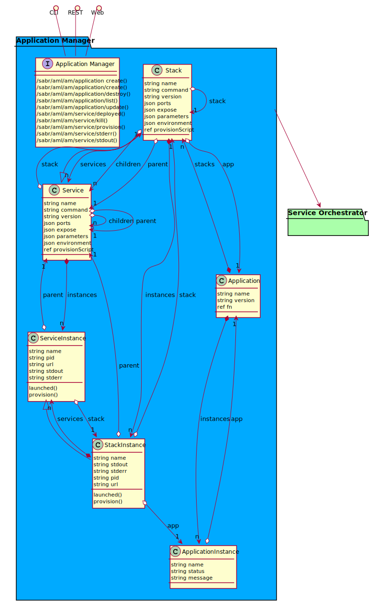

# Application Manager

Application Manager is a package that contains allows to define application that canbe deployed in the SABR environment. An application is a collection of SABR connected together.

## Use Cases

The following are the use cases of the Application Manager subsystem. Each use case has primary and secondary scenarios
that are elaborated in the use case descriptions.

* [Manage Application](usecase-ManageApplication)

## Users

The following are the actors of the Application Manager subsystem. This can include people, other subsystems 
inside the solution and even external subsystems. 

* [DevOpsEngineer](actor-devopsengineer)
* [SoftwareDeveloper](actor-softwaredeveloper)

## Interface

The subsystem has a REST, CLI, WebSocket, and Web interface. Use Cases and Scenarios can use any or all
of the interfaces to perform the work that needs to be completed. The following  diagram shows how
users interact with the system.

* [ sabr aml am data create](#action--sabr-aml-am-data-create)
* [ sabr aml am data govern](#action--sabr-aml-am-data-govern)
* [ sabr aml am service deployed](#action--sabr-aml-am-service-deployed)
* [ sabr aml am service kill](#action--sabr-aml-am-service-kill)
* [ sabr aml am service provision](#action--sabr-aml-am-service-provision)
* [ sabr aml am service stderr](#action--sabr-aml-am-service-stderr)
* [ sabr aml am service stdout](#action--sabr-aml-am-service-stdout)

## Logical Artifacts

The Data Model for the  Application Manager subsystem shows how the different objects and classes of object interact
and their structure.

### Sub Packages

The Application Manager subsystem has sub packages as well. These subsystems are logical components to better
organize the architecture and make it easier to analyze, understand, design, and implement.

### Classes

The following are the classes in the data model of the Application Manager subsystem.

* [Application](class-Application)
* [ApplicationInstance](class-ApplicationInstance)
* [Service](class-Service)
* [ServiceInstance](class-ServiceInstance)
* [Stack](class-Stack)
* [StackInstance](class-StackInstance)

## Deployment Architecture

This subsystem is deployed using micro-services as shown in the diagram below. The 'micro' module is
used to implement the micro-services in the system. The subsystem also has an CLI, REST and Web Interface
exposed through a nodejs application. The nodejs application will interface with the micro-services and
can monitor and drive work-flows through the mesh of micro-services. The deployment of the subsystem is 
dependent on the environment it is deployed. This subsystem has the following environments:
* [dev](environment--sabr-aml-am-dev)
* [test](environment--sabr-aml-am-test)
* [prod](environment--sabr-aml-am-prod)

## Physical Architecture

The Application Manager subsystem is physically laid out on a hybrid cloud infrastructure. Each microservice belongs
to a secure micro-segmented network. All of the micro-services communicate to each other and the main app through a
REST interface. A Command Line Interface (CLI), REST or Web User interface for the app is how other subsystems or actors 
interact. Requests are forwarded to micro-services through the REST interface of each micro-service. The subsystem has
the a unique layout based on the environment the physical space. The following are the environments for this
subsystems.
* [dev](environment--sabr-aml-am-dev)
* [test](environment--sabr-aml-am-test)
* [prod](environment--sabr-aml-am-prod)

## Micro-Services

These are the micro-services for the subsystem. The combination of the micro-services help implement
the subsystem's logic.

### dev

Detail information for the [dev environment](environment--sabr-aml-am-dev)
can be found [here](environment--sabr-aml-am-dev)

Services in the dev environment

* child : child_image:latest
* frontend : _am_web
* gw : _am_gw

### test

Detail information for the [test environment](environment--sabr-aml-am-test)
can be found [here](environment--sabr-aml-am-test)

Services in the test environment

* child : child_image:latest
* frontend : _am_web
* gw : _am_gw

### prod

Detail information for the [prod environment](environment--sabr-aml-am-prod)
can be found [here](environment--sabr-aml-am-prod)

Services in the prod environment

* child : child_image:latest
* frontend : _am_web
* gw : _am_gw

## Activities and Flows
The Application Manager subsystem provides the following activities and flows that help satisfy the use
cases and scenarios of the subsystem.

### Messages Sent

TBD

## Interface Details
The Application Manager subsystem has a well defined interface. This interface can be accessed using a
command line interface (CLI), REST interface, and Web user interface. This interface is how all other
subsystems and actors can access the system.

### Action  sabr aml am data create

* REST - /sabr/aml/am/data/create
* bin -  sabr aml am data create
* js - .sabr.aml.am.data.create

Description of the action

| Name | Type | Required | Description |
|---|---|---|---|
| attr1 | string |false | Description for the parameter |

### Action  sabr aml am data govern

* REST - /sabr/aml/am/data/govern
* bin -  sabr aml am data govern
* js - .sabr.aml.am.data.govern

Description of the action

| Name | Type | Required | Description |
|---|---|---|---|
| attr1 | string |false | Description for the parameter |

### Action  sabr aml am service deployed

* REST - /sabr/aml/am/service/deployed
* bin -  sabr aml am service deployed
* js - .sabr.aml.am.service.deployed

Service is deployed

| Name | Type | Required | Description |
|---|---|---|---|
| service | string |true | ID of the Service that is ready |
| url | string |false | URL or streamID of the service that is ready |

### Action  sabr aml am service kill

* REST - /sabr/aml/am/service/kill
* bin -  sabr aml am service kill
* js - .sabr.aml.am.service.kill

Service is being killed

| Name | Type | Required | Description |
|---|---|---|---|

### Action  sabr aml am service provision

* REST - /sabr/aml/am/service/provision
* bin -  sabr aml am service provision
* js - .sabr.aml.am.service.provision

Provision the service

| Name | Type | Required | Description |
|---|---|---|---|
| service | string |true | Name or ID of the service to provision |
| url | string |true | URL of the service instance |

### Action  sabr aml am service stderr

* REST - /sabr/aml/am/service/stderr
* bin -  sabr aml am service stderr
* js - .sabr.aml.am.service.stderr

Return stderr of the service instance

| Name | Type | Required | Description |
|---|---|---|---|

### Action  sabr aml am service stdout

* REST - /sabr/aml/am/service/stdout
* bin -  sabr aml am service stdout
* js - .sabr.aml.am.service.stdout

Return stdout of the service instance

| Name | Type | Required | Description |
|---|---|---|---|

