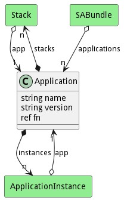

# Application

Application contains several SABRs stitched together to create capabilities

## Attributes

* name:string - Name of the Application
* version:string - Version of the Application
* fn:ref - Function to call with the bundle instance when the bundle instance is run.

## Associations

| Name | Cardinality | Class | Composition | Owner | Description |
| --- | --- | --- | --- | --- | --- |
| stacks | n | Stack | true | true |  |
| instances | n | ApplicationInstance | true | true |  |

## Users of the Model

| Name | Cardinality | Class | Composition | Owner | Description |
| --- | --- | --- | --- | --- | --- |
| app | 1 | ApplicationInstance | false | false |  |
| app | 1 | Stack | false | false | Applications of the stacks |
| applications | n | SABundle |  |  |  |

## Methods

<h2>Method Details</h2>
    

