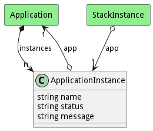
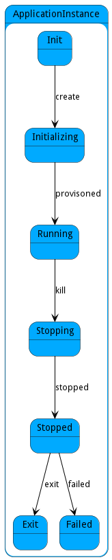

# ApplicationInstance

An Application Instance represents an application that is running in the ecosystem

## Attributes

* name:string - Name of the application instance
* status:string - Name of the application instance
* message:string - Last message in the application instance

## Associations

| Name | Cardinality | Class | Composition | Owner | Description |
| --- | --- | --- | --- | --- | --- |
| app | 1 | Application | false | false |  |

## Users of the Model

| Name | Cardinality | Class | Composition | Owner | Description |
| --- | --- | --- | --- | --- | --- |
| instances | n | Application | true | true |  |
| app | 1 | StackInstance | false | false | Application Instance of the stack instance |

## State Net
The ApplicationInstance has a state net corresponding to instances of the class. Each state transistion will emit an 
event that can be caught with a websocket client. The name of the event is the name of the state in all lower case.
The following diagram is the state net for this class.

| Name | Description | Events |
| --- | --- | --- |
| Init | Initial State of the Application Instance | create-&gt;Initializing,  |
| Initializing | When a ApplicationInstance is being initialized in the ecosystem. | provisoned-&gt;Running,  |
| Running | The ApplicationInstance is running in the ecosystem. | kill-&gt;Stopping,  |
| Stopping | The ApplicationInstance is stopping but not stopped yet. | stopped-&gt;Stopped,  |
| Stopped | The ApplicationInstance has been stopped. | exit-&gt;Exit, failed-&gt;Failed,  |
| Exit | The ApplicationInstance has exited. |  |
| Failed | The ApplicationInstance failed during initailization or after it was running. |  |

## Methods

<h2>Method Details</h2>
    

