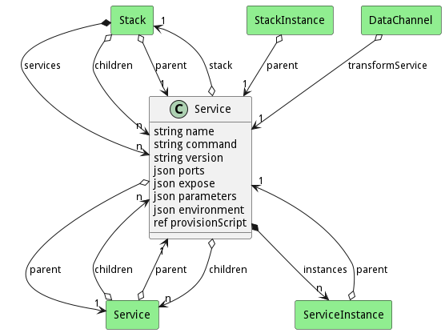

# Service

A Service is an orchestrate element that represents a container or vm running on a resource. The actual execution of the service is tracked by the ServiceInstance. A stack is made up of multiple services.

## Attributes

* name:string - Name of the Service
* command:string - The command to run on the commandline.
* version:string - Version of the Service
* ports:json - List of ports internally
* expose:json - List of ports to expose
* parameters:json - [ {name: value} ] - Lsit of parameters for the service
* environment:json - {name:value, name2:value}
* provisionScript:ref - provision script to run on the deployed service.

## Associations

| Name | Cardinality | Class | Composition | Owner | Description |
| --- | --- | --- | --- | --- | --- |
| stack | 1 | Stack | false | false | Parent Stack of the service |
| children | n | Service | false | false | Child services of the service |
| parent | 1 | Service | false | false | Parent of the service |
| instances | n | ServiceInstance |  | true | Instances of the services. |

## Users of the Model

| Name | Cardinality | Class | Composition | Owner | Description |
| --- | --- | --- | --- | --- | --- |
| children | n | Service | false | false | Child services of the service |
| parent | 1 | Service | false | false | Parent of the service |
| parent | 1 | ServiceInstance |  |  | Service definition for the instance. |
| services | n | Stack | true | true | Services of the stack |
| children | n | Stack | false | false | Child services of the service |
| parent | 1 | Stack | false | false | Parent of the service |
| parent | 1 | StackInstance |  |  | Service definition for the instance. |
| transformService | 1 | DataChannel |  |  | This is the transformation service for the channel. It will summarize the data, give historical data, give all of the data as a passthru, or any other data transformation needed for the individual channel based on the policy applied to the data stream |

## Methods

<h2>Method Details</h2>
    

