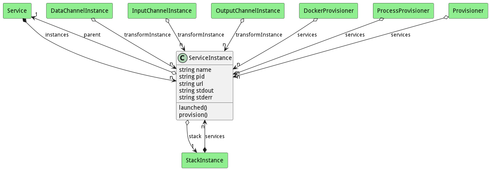

# ServiceInstance

This is an instance of a service running on resources. The Instance is allocated to resources based on the environment and policies of the Service and the Servicelet. A set of actions can be performed on the instance as defined by the runScripts association. 

## Attributes

* name:string - Name of the service instance
* pid:string - process id of the service instance
* url:string - 
* stdout:string - stdout of the instance running.
* stderr:string - stderr of the instance running.

## Associations

| Name | Cardinality | Class | Composition | Owner | Description |
| --- | --- | --- | --- | --- | --- |
| parent | 1 | Service |  |  | Service definition for the instance. |
| stack | 1 | StackInstance | false | false | StackInstance that is running the service instance |

## Users of the Model

| Name | Cardinality | Class | Composition | Owner | Description |
| --- | --- | --- | --- | --- | --- |
| instances | n | Service |  | true | Instances of the services. |
| services | n | StackInstance | true | true | Instances of the Services running in the Stack |
| transformInstance | n | DataChannelInstance |  |  | This is the instance of the transformation Service for the channel. |
| transformInstance | n | InputChannelInstance |  |  | This is the instance of the transformation Service for the channel. |
| transformInstance | n | OutputChannelInstance |  |  | This is the instance of the transformation Service for the channel. |
| services | n | DockerProvisioner | false | false |  |
| services | n | ProcessProvisioner | false | false |  |
| services | n | Provisioner | false | false |  |

## State Net
The ServiceInstance has a state net corresponding to instances of the class. Each state transistion will emit an 
event that can be caught with a websocket client. The name of the event is the name of the state in all lower case.
The following diagram is the state net for this class.

| Name | Description | Events |
| --- | --- | --- |
| Init | Initial State | create-&gt;Created,  |
| Created | Service Instance Created. | launched-&gt;Deploying,  |
| Deploying | Service Instance is deploying. | deployed-&gt;Deployed,  |
| Deployed | Service Instance is deployed and can accept configuration details. | provision-&gt;Provisioning,  |
| Provisioning | Provisioning the instance with confrigurations | provisioned-&gt;Ready, failed-&gt;Failed,  |
| Failed | Failed to provision |  |
| Ready | Service instance is ready to use! | kill-&gt;Killed,  |
| Killed | Service Instance is killed |  |

## Methods
* [launched() - Notification that the Service Instance was launched](#action-launched)
* [provision() - Provision the service with the provision script.](#action-provision)

<h2>Method Details</h2>
    
### Action serviceinstance launched

* REST - serviceinstance/launched?pid=string
* bin - serviceinstance launched --pid string
* js - serviceinstance.launched({ pid:string })

#### Description
Notification that the Service Instance was launched

#### Parameters

| Name | Type | Required | Description |
|---|---|---|---|
| pid | string | | Process id of the service instance |

### Action serviceinstance provision

* REST - serviceinstance/provision?
* bin - serviceinstance provision 
* js - serviceinstance.provision({  })

#### Description
Provision the service with the provision script.

#### Parameters

No parameters

