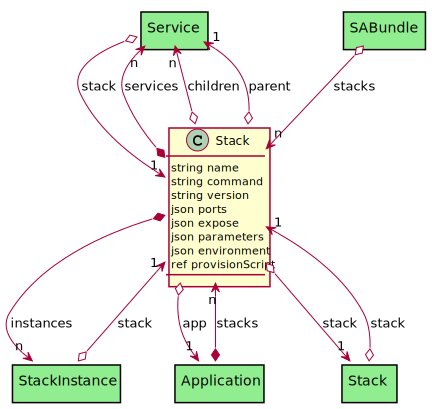

# Stack

A Stack is an aggregation of services in one context. The Stack can have any number of Services and has a stacklet for each environment in the system. Application typically have 1 or more stacks to define their applications.

## Attributes

* name:string - Name of the Service
* command:string - The command to run on the commandline.
* version:string - Version of the Service
* ports:json - List of ports internally
* expose:json - List of ports to expose
* parameters:json - [ {name: value} ] - Lsit of parameters for the service
* environment:json - {name:value, name2:value}
* provisionScript:ref - provision script to run on the deployed service.

## Associations

| Name | Cardinality | Class | Composition | Owner | Description |
| --- | --- | --- | --- | --- | --- |
| services | n | Service | true | true | Services of the stack |
| instances | n | StackInstance | true | true | Instances of the stack |
| app | 1 | Application | false | false | Applications of the stacks |
| stack | 1 | Stack | false | false | Parent Stack of the service |
| children | n | Service | false | false | Child services of the service |
| parent | 1 | Service | false | false | Parent of the service |

## Users of the Model

| Name | Cardinality | Class | Composition | Owner | Description |
| --- | --- | --- | --- | --- | --- |
| stacks | n | Application | true | true |  |
| stack | 1 | Service | false | false | Parent Stack of the service |
| stack | 1 | Stack | false | false | Parent Stack of the service |
| stack | 1 | StackInstance | false | false | Stack of the Stack Instance |
| stacks | n | SABundle | false | false |  |
| stacks | n | Application | true | true |  |
| stack | 1 | Service | false | false | Parent Stack of the service |
| stack | 1 | Stack | false | false | Parent Stack of the service |
| stack | 1 | StackInstance | false | false | Stack of the Stack Instance |
| stacks | n | SABundle | false | false |  |
| stacks | n | Application | true | true |  |
| stack | 1 | Service | false | false | Parent Stack of the service |
| stack | 1 | Stack | false | false | Parent Stack of the service |
| stack | 1 | StackInstance | false | false | Stack of the Stack Instance |
| stacks | n | SABundle | false | false |  |
| stacks | n | Application | true | true |  |
| stack | 1 | Service | false | false | Parent Stack of the service |
| stack | 1 | Stack | false | false | Parent Stack of the service |
| stack | 1 | StackInstance | false | false | Stack of the Stack Instance |
| stacks | n | SABundle | false | false |  |
| stacks | n | Application | true | true |  |
| stack | 1 | Service | false | false | Parent Stack of the service |
| stack | 1 | Stack | false | false | Parent Stack of the service |
| stack | 1 | StackInstance | false | false | Stack of the Stack Instance |
| stacks | n | SABundle | false | false |  |
| stacks | n | Application | true | true |  |
| stack | 1 | Service | false | false | Parent Stack of the service |
| stack | 1 | Stack | false | false | Parent Stack of the service |
| stack | 1 | StackInstance | false | false | Stack of the Stack Instance |
| stacks | n | SABundle | false | false |  |
| stacks | n | Application | true | true |  |
| stack | 1 | Service | false | false | Parent Stack of the service |
| stack | 1 | Stack | false | false | Parent Stack of the service |
| stack | 1 | StackInstance | false | false | Stack of the Stack Instance |
| stacks | n | SABundle | false | false |  |
| stacks | n | Application | true | true |  |
| stack | 1 | Service | false | false | Parent Stack of the service |
| stack | 1 | Stack | false | false | Parent Stack of the service |
| stack | 1 | StackInstance | false | false | Stack of the Stack Instance |
| stacks | n | SABundle | false | false |  |
| stacks | n | Application | true | true |  |
| stack | 1 | Service | false | false | Parent Stack of the service |
| stack | 1 | Stack | false | false | Parent Stack of the service |
| stack | 1 | StackInstance | false | false | Stack of the Stack Instance |
| stacks | n | SABundle | false | false |  |
| stacks | n | Application | true | true |  |
| stack | 1 | Service | false | false | Parent Stack of the service |
| stack | 1 | Stack | false | false | Parent Stack of the service |
| stack | 1 | StackInstance | false | false | Stack of the Stack Instance |
| stacks | n | SABundle | false | false |  |
| stacks | n | Application | true | true |  |
| stack | 1 | Service | false | false | Parent Stack of the service |
| stack | 1 | Stack | false | false | Parent Stack of the service |
| stack | 1 | StackInstance | false | false | Stack of the Stack Instance |
| stacks | n | SABundle | false | false |  |
| stacks | n | Application | true | true |  |
| stack | 1 | Service | false | false | Parent Stack of the service |
| stack | 1 | Stack | false | false | Parent Stack of the service |
| stack | 1 | StackInstance | false | false | Stack of the Stack Instance |
| stacks | n | SABundle | false | false |  |
| stacks | n | Application | true | true |  |
| stack | 1 | Service | false | false | Parent Stack of the service |
| stack | 1 | Stack | false | false | Parent Stack of the service |
| stack | 1 | StackInstance | false | false | Stack of the Stack Instance |
| stacks | n | SABundle | false | false |  |
| stacks | n | Application | true | true |  |
| stack | 1 | Service | false | false | Parent Stack of the service |
| stack | 1 | Stack | false | false | Parent Stack of the service |
| stack | 1 | StackInstance | false | false | Stack of the Stack Instance |
| stacks | n | SABundle | false | false |  |
| stacks | n | Application | true | true |  |
| stack | 1 | Service | false | false | Parent Stack of the service |
| stack | 1 | Stack | false | false | Parent Stack of the service |
| stack | 1 | StackInstance | false | false | Stack of the Stack Instance |
| stacks | n | SABundle | false | false |  |

## Methods

<h2>Method Details</h2>
    

