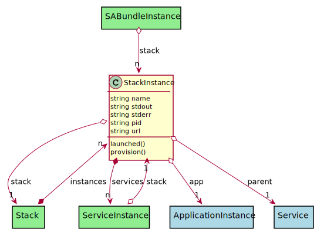
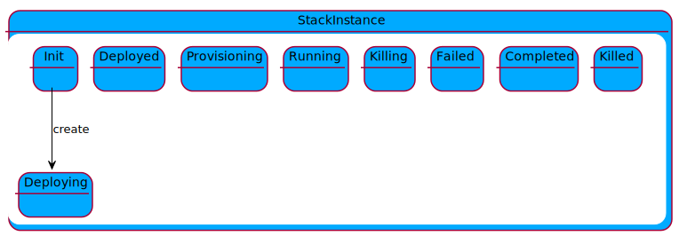

# StackInstance

The StackInstance is the execution of the Stack. This allows for control of the stack during execution.

## Attributes

* name:string - Name of the stackinstance
* stdout:string - 
* stderr:string - 
* pid:string - process id of the service instance
* url:string - 

## Associations

| Name | Cardinality | Class | Composition | Owner | Description |
| --- | --- | --- | --- | --- | --- |
| app | 1 | ApplicationInstance | false | false | Application Instance of the stack instance |
| stack | 1 | Stack | false | false | Stack of the Stack Instance |
| services | n | ServiceInstance | true | true | Instances of the Services running in the Stack |
| parent | 1 | Service |  |  | Service definition for the instance. |

## Users of the Model

| Name | Cardinality | Class | Composition | Owner | Description |
| --- | --- | --- | --- | --- | --- |
| stack | 1 | ServiceInstance | false | false | StackInstance that is running the service instance |
| instances | n | Stack | true | true | Instances of the stack |
| stack | n | SABundleInstance | false | false |  |
| stack | 1 | ServiceInstance | false | false | StackInstance that is running the service instance |
| instances | n | Stack | true | true | Instances of the stack |
| stack | n | SABundleInstance | false | false |  |
| stack | 1 | ServiceInstance | false | false | StackInstance that is running the service instance |
| instances | n | Stack | true | true | Instances of the stack |
| stack | n | SABundleInstance | false | false |  |
| stack | 1 | ServiceInstance | false | false | StackInstance that is running the service instance |
| instances | n | Stack | true | true | Instances of the stack |
| stack | n | SABundleInstance | false | false |  |
| stack | 1 | ServiceInstance | false | false | StackInstance that is running the service instance |
| instances | n | Stack | true | true | Instances of the stack |
| stack | n | SABundleInstance | false | false |  |
| stack | 1 | ServiceInstance | false | false | StackInstance that is running the service instance |
| instances | n | Stack | true | true | Instances of the stack |
| stack | n | SABundleInstance | false | false |  |
| stack | 1 | ServiceInstance | false | false | StackInstance that is running the service instance |
| instances | n | Stack | true | true | Instances of the stack |
| stack | n | SABundleInstance | false | false |  |
| stack | 1 | ServiceInstance | false | false | StackInstance that is running the service instance |
| instances | n | Stack | true | true | Instances of the stack |
| stack | n | SABundleInstance | false | false |  |
| stack | 1 | ServiceInstance | false | false | StackInstance that is running the service instance |
| instances | n | Stack | true | true | Instances of the stack |
| stack | n | SABundleInstance | false | false |  |
| stack | 1 | ServiceInstance | false | false | StackInstance that is running the service instance |
| instances | n | Stack | true | true | Instances of the stack |
| stack | n | SABundleInstance | false | false |  |
| stack | 1 | ServiceInstance | false | false | StackInstance that is running the service instance |
| instances | n | Stack | true | true | Instances of the stack |
| stack | n | SABundleInstance | false | false |  |
| stack | 1 | ServiceInstance | false | false | StackInstance that is running the service instance |
| instances | n | Stack | true | true | Instances of the stack |
| stack | n | SABundleInstance | false | false |  |
| stack | 1 | ServiceInstance | false | false | StackInstance that is running the service instance |
| instances | n | Stack | true | true | Instances of the stack |
| stack | n | SABundleInstance | false | false |  |
| stack | 1 | ServiceInstance | false | false | StackInstance that is running the service instance |
| instances | n | Stack | true | true | Instances of the stack |
| stack | n | SABundleInstance | false | false |  |
| stack | 1 | ServiceInstance | false | false | StackInstance that is running the service instance |
| instances | n | Stack | true | true | Instances of the stack |
| stack | n | SABundleInstance | false | false |  |

## State Net

| Name | Description | Events |
| --- | --- | --- |
| Init | Initial State | create-&gt;Deploying,  |
| Deploying | Deploying the Stack Instance by provisioning all the resources and data for the services | requestData-&gt;undefined, requestResources-&gt;undefined,  |
| Deployed | The Service is deployed and ready for provisioning |  |
| Provisioning | The Service is provisioning software. |  |
| Running |  |  |
| Killing |  |  |
| Failed |  |  |
| Completed |  |  |
| Killed |  |  |

## Methods

* [launched() - The Service Instance was launched](#action-launched)

* [provision() - Provision the service with the provsion script.](#action-provision)

<h2>Method Details</h2>
    
### Action stackinstance launched

* REST - stackinstance/launched
* bin - stackinstance launched
* js - stackinstance.launched

The Service Instance was launched

| Name | Type | Required | Description |
|---|---|---|---|
| pid | string | | Process id of the service instance |

### Action stackinstance provision

* REST - stackinstance/provision
* bin - stackinstance provision
* js - stackinstance.provision

Provision the service with the provsion script.

| Name | Type | Required | Description |
|---|---|---|---|

