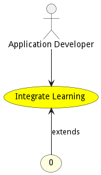

# Integrate Learning

Integrate Learning allows application developers to integrate learnings from the AI algorithms into applications. This allows the insight gained from the AI models to be used to aid the tactical operator, helps an application run more effectively, or provide information to a high level orchestrator.

## Actors

* [Application Developer](actor-applicationdeveloper)

## Extends Use Cases

* [Provide Digital Assistance](usecase-ProvideDigitalAssistance)

## Detail Scenarios

