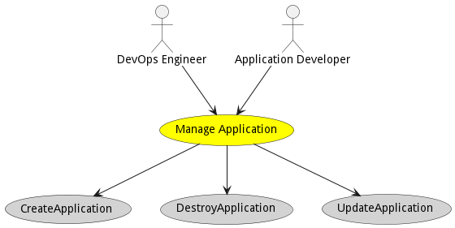
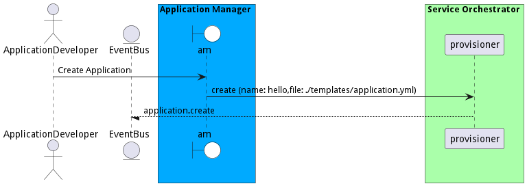
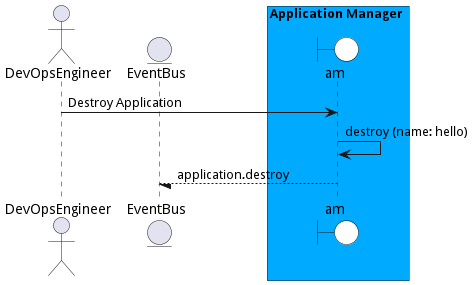
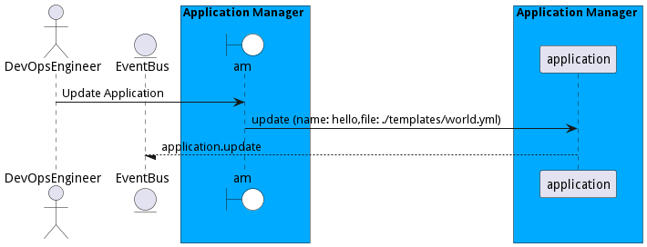

# Manage Application

Manage Applications in the system. Including creating, deploying, and updating. Applications are primarily managed by DevOps engineers and developed by an application developer.

## Actors

* [DevOps Engineer](actor-devops)
* [Application Developer](actor-applicationdeveloper)

## Detail Scenarios

* [CreateApplication](#scenario-CreateApplication)
* [DestroyApplication](#scenario-DestroyApplication)
* [UpdateApplication](#scenario-UpdateApplication)

### Scenario Create Application

Application developers create application that can be deployed in the ecosystem. This is created in the traditional DevSecOps pipeline.

#### Steps
1. [application create --name hello --file ./templates/application.yml](#action-application-create)

#### Actors

* [Application Developer](actor-applicationdeveloper)

### Scenario Destroy Application

DevOps engineer can decommission applications in the ecosystem by destroying applications in the ecosystem.

#### Steps
1. [application destroy --name hello](#action-application-destroy)

#### Actors

* [DevOps Engineer](actor-devops)

### Scenario Update Application

A DevSecOps engineer utilizes the DevSecOps pipeline to update an application that has been deployed in the ecosystem. There are several updating models that can be utilized to update the application, including staggered updates, and blue-green updates.

#### Steps
1. [application update --name hello --file ./templates/world.yml](#action-application-update)

#### Actors

* [DevOps Engineer](actor-devops)

