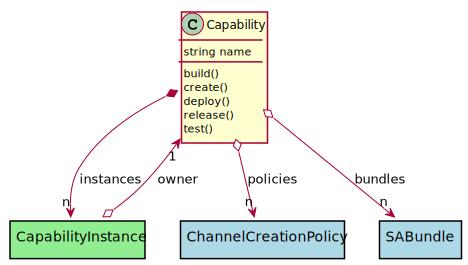

# Capability

Capabilities are deployed across multiple assets in the ecosystem. They consist of connecting multiple SABRs together to show a flow of data through the system.

## Attributes

* name:string - Name of the capability to deploy to the network

## Associations

| Name | Cardinality | Class | Composition | Owner | Description |
| --- | --- | --- | --- | --- | --- |
| policies | n | StreamPolicy |  |  | Policies to apply to the bundles when they are deployed. |
| bundles | n | SABundle | false | false |  |
| instances | n | CapabilityInstance | true | true |  |

## Users of the Model

| Name | Cardinality | Class | Composition | Owner | Description |
| --- | --- | --- | --- | --- | --- |
| owner | 1 | CapabilityInstance | false | false | Owner of the instance is the capability. |
| owner | 1 | CapabilityInstance | false | false | Owner of the instance is the capability. |
| owner | 1 | CapabilityInstance | false | false | Owner of the instance is the capability. |
| owner | 1 | CapabilityInstance | false | false | Owner of the instance is the capability. |
| owner | 1 | CapabilityInstance | false | false | Owner of the instance is the capability. |
| owner | 1 | CapabilityInstance | false | false | Owner of the instance is the capability. |
| owner | 1 | CapabilityInstance | false | false | Owner of the instance is the capability. |
| owner | 1 | CapabilityInstance | false | false | Owner of the instance is the capability. |
| owner | 1 | CapabilityInstance | false | false | Owner of the instance is the capability. |
| owner | 1 | CapabilityInstance | false | false | Owner of the instance is the capability. |
| owner | 1 | CapabilityInstance | false | false | Owner of the instance is the capability. |
| owner | 1 | CapabilityInstance | false | false | Owner of the instance is the capability. |
| owner | 1 | CapabilityInstance | false | false | Owner of the instance is the capability. |
| owner | 1 | CapabilityInstance | false | false | Owner of the instance is the capability. |
| owner | 1 | CapabilityInstance | false | false | Owner of the instance is the capability. |

## Methods

* [build() - Create a Capability](#action-build)

* [create() - Create a Capability](#action-create)

* [deploy() - Create a Capability](#action-deploy)

* [release() - Create a Capability](#action-release)

* [test() - Create a Capability](#action-test)

<h2>Method Details</h2>
    
### Action capability build

* REST - capability/build
* bin - capability build
* js - capability.build

Create a Capability

| Name | Type | Required | Description |
|---|---|---|---|
| name | string |true | name of the capability |

### Action capability create

* REST - capability/create
* bin - capability create
* js - capability.create

Create a Capability

| Name | Type | Required | Description |
|---|---|---|---|
| name | string |true | name of the capability |
| file | file |false | file with the definition |

### Action capability deploy

* REST - capability/deploy
* bin - capability deploy
* js - capability.deploy

Create a Capability

| Name | Type | Required | Description |
|---|---|---|---|

### Action capability release

* REST - capability/release
* bin - capability release
* js - capability.release

Create a Capability

| Name | Type | Required | Description |
|---|---|---|---|
| name | string |true | name of the capability |

### Action capability test

* REST - capability/test
* bin - capability test
* js - capability.test

Create a Capability

| Name | Type | Required | Description |
|---|---|---|---|
| name | string |true | name of the capability |
| file | YAML |false | file with the definition |

