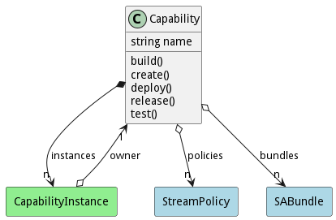

# Capability

Capabilities are deployed across multiple assets in the ecosystem. They consist of connecting multiple SABRs together to show a flow of data through the system. The Capability contains policies that define how the SABR bundles should react to different events in the system. Instances of the Capabilities are managed from the capability manager and consist of all of the information about the running capability.

## Attributes

* name:string - Name of the capability to deploy to the network

## Associations

| Name | Cardinality | Class | Composition | Owner | Description |
| --- | --- | --- | --- | --- | --- |
| policies | n | StreamPolicy |  |  | Policies to apply to the bundles when they are deployed. |
| bundles | n | SABundle | false | false | SABR Bundles that make up the Capabilities. |
| instances | n | CapabilityInstance | true | true | This is a instance of capability running in the ecosystem. |

## Users of the Model

| Name | Cardinality | Class | Composition | Owner | Description |
| --- | --- | --- | --- | --- | --- |
| owner | 1 | CapabilityInstance | false | false | Owner of the instance is the capability. |

## State Net
The Capability has a state net corresponding to instances of the class. Each state transistion will emit an 
event that can be caught with a websocket client. The name of the event is the name of the state in all lower case.
The following diagram is the state net for this class.

| Name | Description | Events |
| --- | --- | --- |
| Init | Initial State | create-&gt;Created,  |
| Created | The Capability has been created and ready and can be built. | build-&gt;Building,  |
| Building | The Capability is being built. | built-&gt;Built,  |
| Built | The Capability has been built and ready to be deployed. | test-&gt;Testing,  |
| Testing | The Capability is aggregated with all of the SABRs | testSuccess-&gt;Tested,  |
| Tested | The Capability is aggregated with all of the SABRs | release-&gt;Released,  |
| Released | The Capability is released and ready for Deployment | deploy-&gt;Released,  |
| Failed | The Capability failed to be built or created. |  |

## Methods
* [build() - Build a Capability](#action-build)
* [create() - Create a Capability](#action-create)
* [deploy() - Deploy a Capability](#action-deploy)
* [release() - Release a Capability](#action-release)
* [test() - Test a Capability](#action-test)

<h2>Method Details</h2>
    
### Action capability build

* REST - capability/build?name=string
* bin - capability build --name string
* js - capability.build({ name:string })

#### Description
Build a Capability

#### Parameters

| Name | Type | Required | Description |
|---|---|---|---|
| name | string |true | name of the build |

### Action capability create

* REST - capability/create?name=string&amp;file=file
* bin - capability create --name string --file file
* js - capability.create({ name:string,file:file })

#### Description
Create a Capability

#### Parameters

| Name | Type | Required | Description |
|---|---|---|---|
| name | string |true | name of the capability |
| file | file |false | file with the definition |

### Action capability deploy

* REST - capability/deploy?
* bin - capability deploy 
* js - capability.deploy({  })

#### Description
Deploy a Capability

#### Parameters

No parameters

### Action capability release

* REST - capability/release?name=string
* bin - capability release --name string
* js - capability.release({ name:string })

#### Description
Release a Capability

#### Parameters

| Name | Type | Required | Description |
|---|---|---|---|
| name | string |true | name of the capability |

### Action capability test

* REST - capability/test?name=string&amp;file=YAML
* bin - capability test --name string --file YAML
* js - capability.test({ name:string,file:YAML })

#### Description
Test a Capability

#### Parameters

| Name | Type | Required | Description |
|---|---|---|---|
| name | string |true | name of the capability |
| file | YAML |false | file with the definition |

