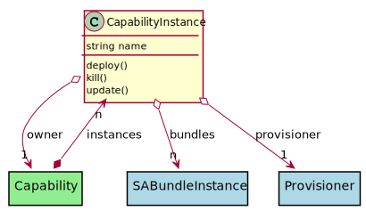
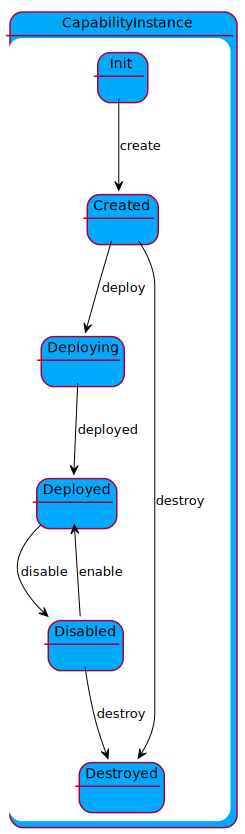

# CapabilityInstance

Description long description

## Attributes

* name:string - Instance of the capability running in the system

## Associations

| Name | Cardinality | Class | Composition | Owner | Description |
| --- | --- | --- | --- | --- | --- |
| bundles | n | SABundleInstance |  |  | Bundle instances running on the ecosystem. |
| owner | 1 | Capability | false | false | Owner of the instance is the capability. |

## Users of the Model

| Name | Cardinality | Class | Composition | Owner | Description |
| --- | --- | --- | --- | --- | --- |
| instances | n | Capability | true | true |  |
| instances | n | Capability | true | true |  |
| instances | n | Capability | true | true |  |
| instances | n | Capability | true | true |  |
| instances | n | Capability | true | true |  |
| instances | n | Capability | true | true |  |
| instances | n | Capability | true | true |  |
| instances | n | Capability | true | true |  |
| instances | n | Capability | true | true |  |
| instances | n | Capability | true | true |  |
| instances | n | Capability | true | true |  |
| instances | n | Capability | true | true |  |
| instances | n | Capability | true | true |  |
| instances | n | Capability | true | true |  |
| instances | n | Capability | true | true |  |

## State Net

| Name | Description | Events |
| --- | --- | --- |
| Init | Initial State | create-&gt;Created,  |
| Created | Capability is created | deploy-&gt;Deploying, destroy-&gt;Destroyed,  |
| Deploying | Capability is deploying | deployed-&gt;Deployed,  |
| Deployed | The Capability is Deployed. | disable-&gt;Disabled,  |
| Disabled | Stream is disabled | enable-&gt;Deployed, destroy-&gt;Destroyed,  |
| Destroyed | Stream is destroyed |  |

## Methods

* [deploy() - Create a Capability](#action-deploy)

<h2>Method Details</h2>
    
### Action capabilityinstance deploy

* REST - capabilityinstance/deploy
* bin - capabilityinstance deploy
* js - capabilityinstance.deploy

Create a Capability

| Name | Type | Required | Description |
|---|---|---|---|

