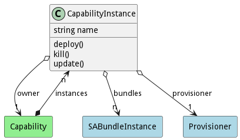
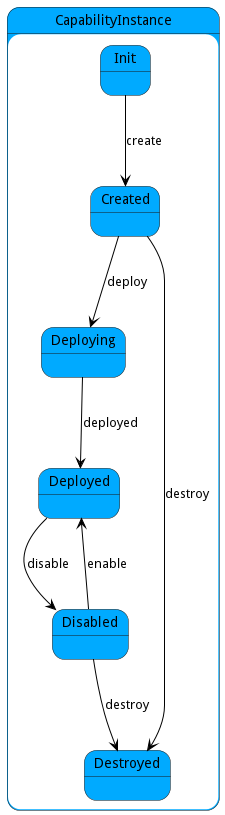

# CapabilityInstance

A CapabilityInstance contains the execution environment, logging, and state of a running capability in the ecosystem. This model provides an interface to manage and control the running instance.

## Attributes

* name:string - Instance of the capability running in the system

## Associations

| Name | Cardinality | Class | Composition | Owner | Description |
| --- | --- | --- | --- | --- | --- |
| bundles | n | SABundleInstance |  |  | Bundle instances running on the ecosystem. |
| owner | 1 | Capability | false | false | Owner of the instance is the capability. |

## Users of the Model

| Name | Cardinality | Class | Composition | Owner | Description |
| --- | --- | --- | --- | --- | --- |
| instances | n | Capability | true | true | This is a instance of capability running in the ecosystem. |

## State Net
The CapabilityInstance has a state net corresponding to instances of the class. Each state transistion will emit an 
event that can be caught with a websocket client. The name of the event is the name of the state in all lower case.
The following diagram is the state net for this class.

| Name | Description | Events |
| --- | --- | --- |
| Init | Initial State | create-&gt;Created,  |
| Created | Capability is created | deploy-&gt;Deploying, destroy-&gt;Destroyed,  |
| Deploying | Capability is deploying | deployed-&gt;Deployed,  |
| Deployed | The Capability is Deployed. | disable-&gt;Disabled,  |
| Disabled | Stream is disabled | enable-&gt;Deployed, destroy-&gt;Destroyed,  |
| Destroyed | Stream is destroyed |  |

## Methods

* [deploy() - Deploy a CapabilityInstance](#action-deploy)

* [kill() - Kill a CapabilityInstance that is running in the ecosystem including all of the SABRs controlled by the capability.](#action-kill)

* [update() - Update a CapabilityInstance that is running in the ecosystem including all of the SABRs controlled by the capability.](#action-update)

<h2>Method Details</h2>
    
### Action capabilityinstance deploy

* REST - capabilityinstance/deploy?
* bin - capabilityinstance deploy 
* js - capabilityinstance.deploy({  })

#### Description
Deploy a CapabilityInstance

#### Parameters

No parameters

### Action capabilityinstance kill

* REST - capabilityinstance/kill?signal=number
* bin - capabilityinstance kill --signal number
* js - capabilityinstance.kill({ signal:number })

#### Description
Kill a CapabilityInstance that is running in the ecosystem including all of the SABRs controlled by the capability.

#### Parameters

| Name | Type | Required | Description |
|---|---|---|---|
| signal | number |false | Signal of the kill command. |

### Action capabilityinstance update

* REST - capabilityinstance/update?definition=json
* bin - capabilityinstance update --definition json
* js - capabilityinstance.update({ definition:json })

#### Description
Update a CapabilityInstance that is running in the ecosystem including all of the SABRs controlled by the capability.

#### Parameters

| Name | Type | Required | Description |
|---|---|---|---|
| definition | json |true | Definition of the Capability that is being updated. |

