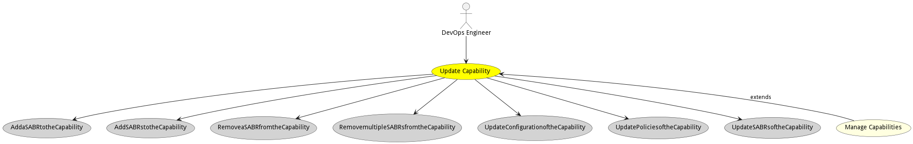
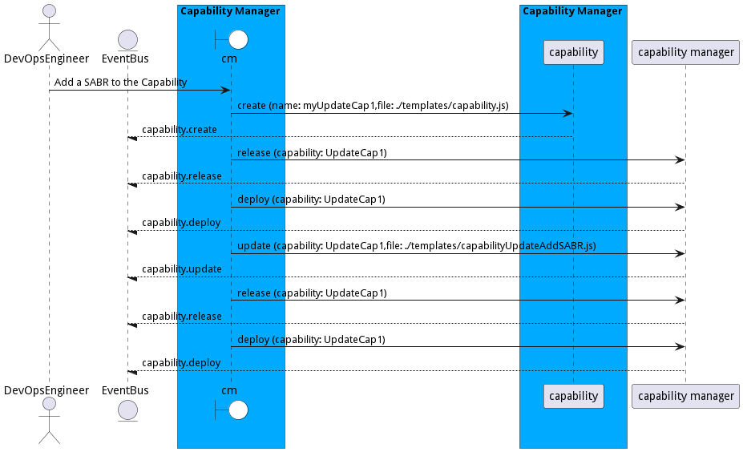
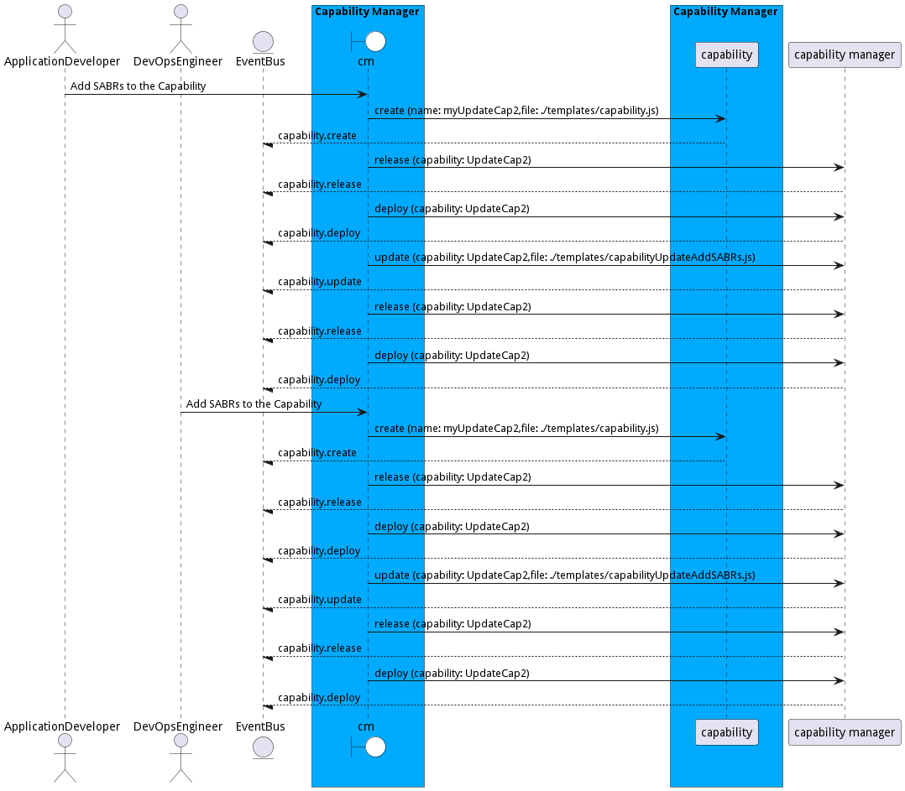
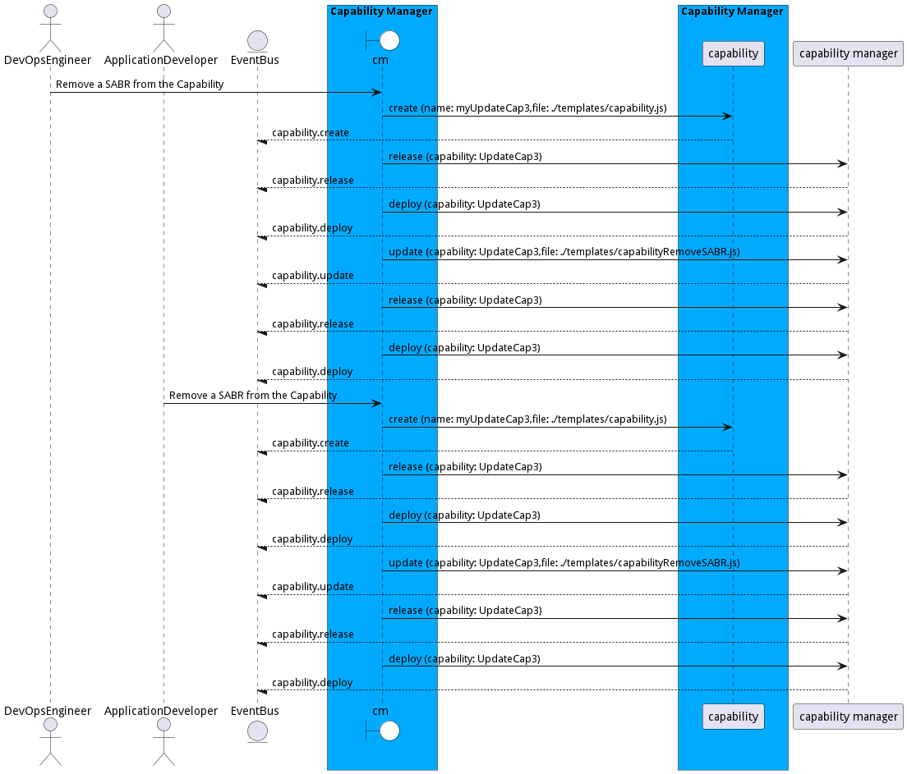
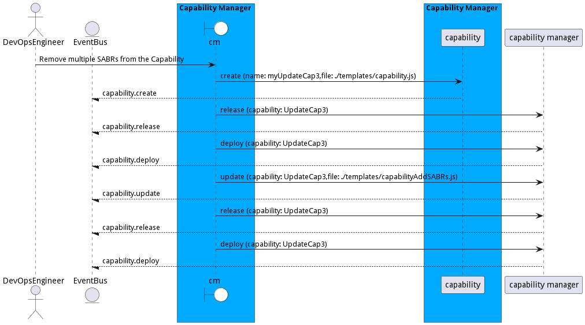
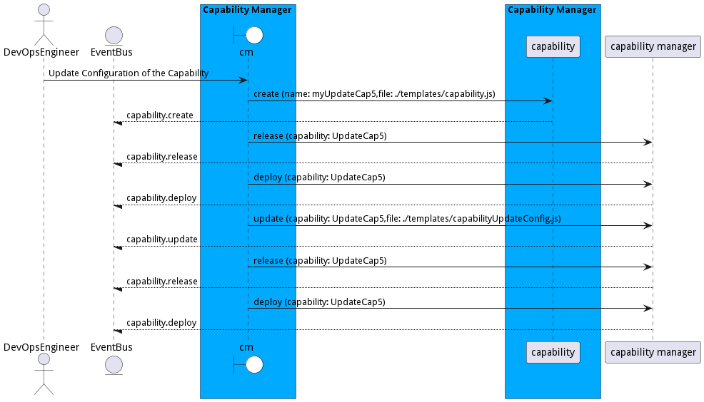
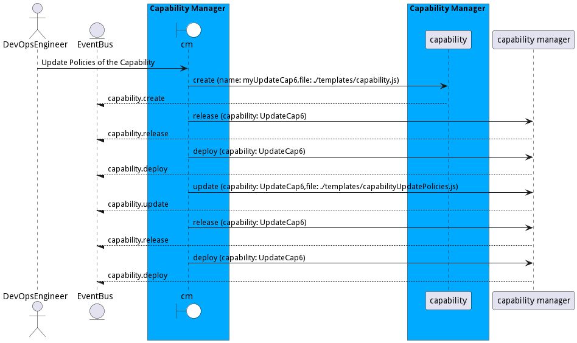
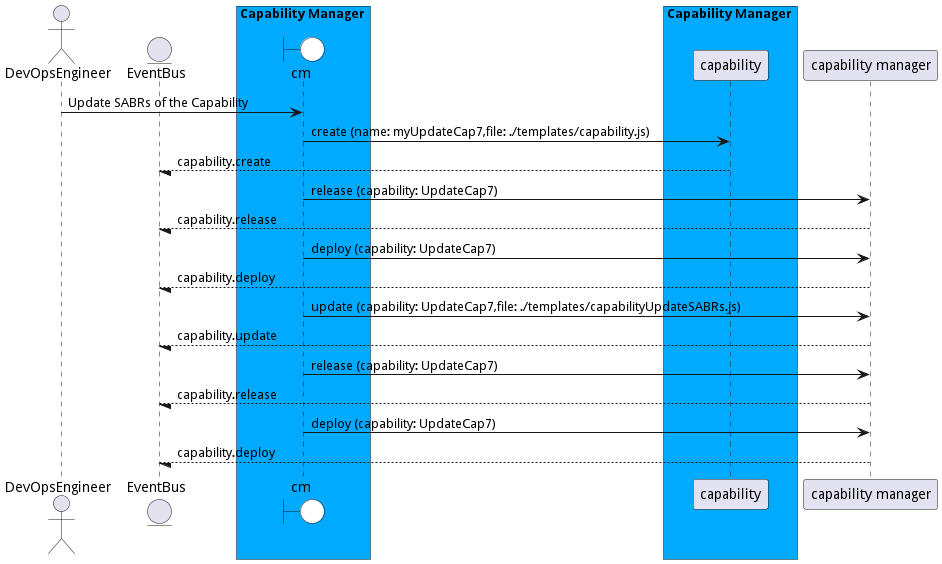

# Update Capability

Update Capability allows a DevOps Engineer to update a capability in the ecosystem. This might include updating configurations, updating SABRs, removing SABRs, or adding SABRs to and existing capability.

## Actors

* [DevOps Engineer](actor-devops)

## Extends Use Cases

* [Manage Capabilities](usecase-ManageCapabilities)

## Detail Scenarios

* [AddaSABRtotheCapability](#scenario-AddaSABRtotheCapability)
* [AddSABRstotheCapability](#scenario-AddSABRstotheCapability)
* [RemoveaSABRfromtheCapability](#scenario-RemoveaSABRfromtheCapability)
* [RemovemultipleSABRsfromtheCapability](#scenario-RemovemultipleSABRsfromtheCapability)
* [UpdateConfigurationoftheCapability](#scenario-UpdateConfigurationoftheCapability)
* [UpdatePoliciesoftheCapability](#scenario-UpdatePoliciesoftheCapability)
* [UpdateSABRsoftheCapability](#scenario-UpdateSABRsoftheCapability)

### Scenario Add a SABR to the Capability

Add a SABR of the a running capability.

#### Steps
1. [capability create --name myUpdateCap1 --file ./templates/capability.js](#action-capability create)
1. [aml cm capability release --capability UpdateCap1](#action-aml cm capability release)
1. [aml cm capability deploy --capability UpdateCap1](#action-aml cm capability deploy)
1. [aml cm capability update --capability UpdateCap1 --file ./templates/capabilityUpdateAddSABR.js](#action-aml cm capability update)
1. [aml cm capability release --capability UpdateCap1](#action-aml cm capability release)
1. [aml cm capability deploy --capability UpdateCap1](#action-aml cm capability deploy)

#### Actors

* [DevOps Engineer](actor-devops)

### Scenario Add SABRs to the Capability

Add Multiple SABRs to a running Capability

#### Steps
1. [capability create --name myUpdateCap2 --file ./templates/capability.js](#action-capability create)
1. [aml cm capability release --capability UpdateCap2](#action-aml cm capability release)
1. [aml cm capability deploy --capability UpdateCap2](#action-aml cm capability deploy)
1. [aml cm capability update --capability UpdateCap2 --file ./templates/capabilityUpdateAddSABRs.js](#action-aml cm capability update)
1. [aml cm capability release --capability UpdateCap2](#action-aml cm capability release)
1. [aml cm capability deploy --capability UpdateCap2](#action-aml cm capability deploy)

#### Actors

* [Application Developer](actor-applicationdeveloper)
* [DevOps Engineer](actor-devops)

### Scenario Remove a SABR from the Capability

Remove a SABR of a running Capability

#### Steps
1. [capability create --name myUpdateCap3 --file ./templates/capability.js](#action-capability create)
1. [aml cm capability release --capability UpdateCap3](#action-aml cm capability release)
1. [aml cm capability deploy --capability UpdateCap3](#action-aml cm capability deploy)
1. [aml cm capability update --capability UpdateCap3 --file ./templates/capabilityRemoveSABR.js](#action-aml cm capability update)
1. [aml cm capability release --capability UpdateCap3](#action-aml cm capability release)
1. [aml cm capability deploy --capability UpdateCap3](#action-aml cm capability deploy)

#### Actors

* [DevOps Engineer](actor-devops)
* [Application Developer](actor-applicationdeveloper)

### Scenario Remove multiple SABRs from the Capability

Remove multiple SABRs from a running Capability

#### Steps
1. [capability create --name myUpdateCap3 --file ./templates/capability.js](#action-capability create)
1. [aml cm capability release --capability UpdateCap3](#action-aml cm capability release)
1. [aml cm capability deploy --capability UpdateCap3](#action-aml cm capability deploy)
1. [aml cm capability update --capability UpdateCap3 --file ./templates/capabilityAddSABRs.js](#action-aml cm capability update)
1. [aml cm capability release --capability UpdateCap3](#action-aml cm capability release)
1. [aml cm capability deploy --capability UpdateCap3](#action-aml cm capability deploy)

#### Actors

* [DevOps Engineer](actor-devops)

### Scenario Update Configuration of the Capability

Update Configuration of a running Capability

#### Steps
1. [capability create --name myUpdateCap5 --file ./templates/capability.js](#action-capability create)
1. [aml cm capability release --capability UpdateCap5](#action-aml cm capability release)
1. [aml cm capability deploy --capability UpdateCap5](#action-aml cm capability deploy)
1. [aml cm capability update --capability UpdateCap5 --file ./templates/capabilityUpdateConfig.js](#action-aml cm capability update)
1. [aml cm capability release --capability UpdateCap5](#action-aml cm capability release)
1. [aml cm capability deploy --capability UpdateCap5](#action-aml cm capability deploy)

#### Actors

* [DevOps Engineer](actor-devops)

### Scenario Update Policies of the Capability

Update Policy of a Running Capability

#### Steps
1. [capability create --name myUpdateCap6 --file ./templates/capability.js](#action-capability create)
1. [aml cm capability release --capability UpdateCap6](#action-aml cm capability release)
1. [aml cm capability deploy --capability UpdateCap6](#action-aml cm capability deploy)
1. [aml cm capability update --capability UpdateCap6 --file ./templates/capabilityUpdatePolicies.js](#action-aml cm capability update)
1. [aml cm capability release --capability UpdateCap6](#action-aml cm capability release)
1. [aml cm capability deploy --capability UpdateCap6](#action-aml cm capability deploy)

#### Actors

* [DevOps Engineer](actor-devops)

### Scenario Update SABRs of the Capability

Update SABRs of a running Capability

#### Steps
1. [capability create --name myUpdateCap7 --file ./templates/capability.js](#action-capability create)
1. [aml cm capability release --capability UpdateCap7](#action-aml cm capability release)
1. [aml cm capability deploy --capability UpdateCap7](#action-aml cm capability deploy)
1. [aml cm capability update --capability UpdateCap7 --file ./templates/capabilityUpdateSABRs.js](#action-aml cm capability update)
1. [aml cm capability release --capability UpdateCap7](#action-aml cm capability release)
1. [aml cm capability deploy --capability UpdateCap7](#action-aml cm capability deploy)

#### Actors

* [DevOps Engineer](actor-devops)

