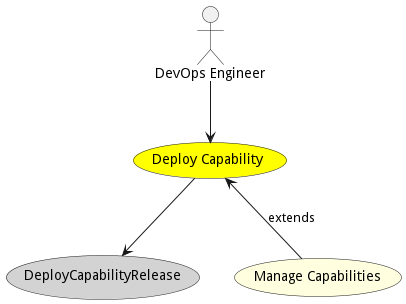
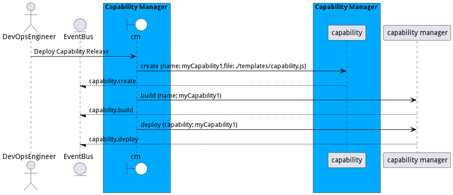

# Deploy Capability

Deploy a capability into the ecosystem. This should deploy all of the SABRs in the capability or attach to currently running SABRs in the defined capabiility.

## Actors

* [DevOps Engineer](actor-devops)

## Extends Use Cases

* [Manage Capabilities](usecase-ManageCapabilities)

## Detail Scenarios

* [DeployCapabilityRelease](#scenario-DeployCapabilityRelease)

### Scenario Deploy Capability Release

Deploy Capability Release allows a capability to be deployed into the ecosystem, which can include several SABRs in the ecosystem across a set of heterogeneous resources.

#### Steps

1. [capability create --name myCapability1 --file ./templates/capability.js](#action-capability create)

1. [aml cm capability deploy --capability myCapability1](#action-aml cm capability deploy)

#### Actors

* [DevOps Engineer](actor-devops)

