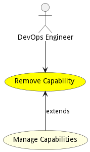

# Remove Capability

Remove Capability allows a DevOps Engineer to remove a capability from the ecosystem. This will remove all SABRs controlled and managed by the capability. It will not remove SABRs that are used by other Capabilties.

## Actors

* [DevOps Engineer](actor-devops)

## Extends Use Cases

* [Manage Capabilities](usecase-ManageCapabilities)

## Detail Scenarios

