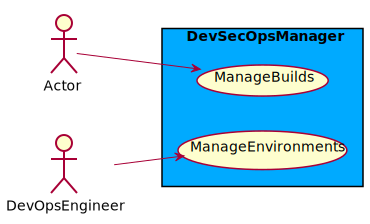
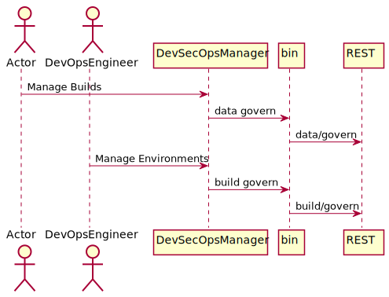
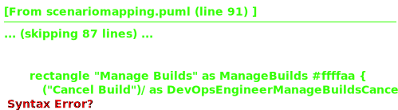
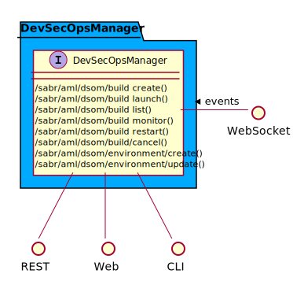
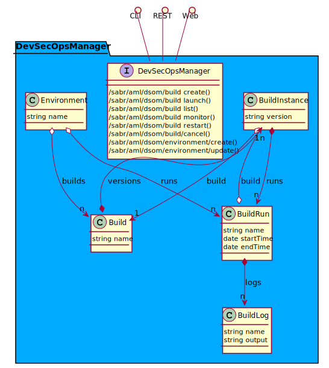

# DevSecOpsManager

DevSecOpsManager is a package that contains...

## Use Cases

The following are the use cases of the DevSecOpsManager subsystem. Each use case has primary and secondary scenarios
that are elaborated in the use case descriptions.

* [Manage Builds](usecase-ManageBuilds)
* [Manage Environments](usecase-ManageEnvironments)

## Users

The following are the actors of the DevSecOpsManager subsystem. This can include people, other subsystems
inside the solution and even external subsystems.

* [Actor](actor-actor)
* [DevOpsEngineer](actor-devops)

## Interface

The subsystem has a REST, CLI, WebSocket, and Web interface. Use Cases and Scenarios can use any or all
of the interfaces to perform the work that needs to be completed. The following  diagram shows how
users interact with the system.

* [ sabr aml dsom build create](#action--sabr-aml-dsom-build create)
* [ sabr aml dsom build launch](#action--sabr-aml-dsom-build launch)
* [ sabr aml dsom build list](#action--sabr-aml-dsom-build list)
* [ sabr aml dsom build monitor](#action--sabr-aml-dsom-build monitor)
* [ sabr aml dsom build restart](#action--sabr-aml-dsom-build restart)
* [ sabr aml dsom build cancel](#action--sabr-aml-dsom-build-cancel)
* [ sabr aml dsom environment create](#action--sabr-aml-dsom-environment-create)
* [ sabr aml dsom environment update](#action--sabr-aml-dsom-environment-update)

## Logical Artifacts

The Data Model for the  DevSecOpsManager subsystem shows how the different objects and classes of object interact
and their structure.

### Sub Packages

The DevSecOpsManager subsystem has sub packages as well. These subsystems are logical components to better
organize the architecture and make it easier to analyze, understand, design, and implement.

### Classes

The following are the classes in the data model of the DevSecOpsManager subsystem.

* [Build](class-Build)
* [BuildInstance](class-BuildInstance)
* [BuildLog](class-BuildLog)
* [BuildRun](class-BuildRun)
* [Environment](class-Environment)

## Deployment Architecture

This subsystem is deployed using micro-services as shown in the diagram below. The 'micro' module is
used to implement the micro-services in the system. The subsystem also has an CLI, REST and Web Interface
exposed through a nodejs application. The nodejs application will interface with the micro-services and
can monitor and drive work-flows through the mesh of micro-services. The deployment of the subsystem is
dependent on the environment it is deployed. This subsystem has the following environments:
* [local](environment--sabr-aml-dsom-local)
* [dev](environment--sabr-aml-dsom-dev)
* [test](environment--sabr-aml-dsom-test)
* [prod](environment--sabr-aml-dsom-prod)

## Physical Architecture

The DevSecOpsManager subsystem is physically laid out on a hybrid cloud infrastructure. Each microservice belongs
to a secure micro-segmented network. All of the micro-services communicate to each other and the main app through a
REST interface. A Command Line Interface (CLI), REST or Web User interface for the app is how other subsystems or actors
interact. Requests are forwarded to micro-services through the REST interface of each micro-service. The subsystem has
the a unique layout based on the environment the physical space. The following are the environments for this
subsystems.
* [local](environment--sabr-aml-dsom-local)
* [dev](environment--sabr-aml-dsom-dev)
* [test](environment--sabr-aml-dsom-test)
* [prod](environment--sabr-aml-dsom-prod)

## Micro-Services

These are the micro-services for the subsystem. The combination of the micro-services help implement
the subsystem's logic.

### local

Detail information for the [local environment](environment--sabr-aml-dsom-local)
can be found [here](environment--sabr-aml-dsom-local)

Services in the local environment

* web : devops
* build : jenkins/jenkins:alpine

### dev

Detail information for the [dev environment](environment--sabr-aml-dsom-dev)
can be found [here](environment--sabr-aml-dsom-dev)

Services in the dev environment

* web : devops
* build : jenkins/jenkins:alpine

### test

Detail information for the [test environment](environment--sabr-aml-dsom-test)
can be found [here](environment--sabr-aml-dsom-test)

Services in the test environment

* web : devops
* build : jenkins/jenkins:alpine

### prod

Detail information for the [prod environment](environment--sabr-aml-dsom-prod)
can be found [here](environment--sabr-aml-dsom-prod)

Services in the prod environment

* web : devops
* build : jenkins/jenkins:alpine

## Activities and Flows
The DevSecOpsManager subsystem provides the following activities and flows that help satisfy the use
cases and scenarios of the subsystem.

### Messages Sent

| Event | Description | Emitter |
|-------|-------------|---------|
| build.create |  When an object of type Build is created. | Build
| build.destroy |  When an object of type Build is destroyed. | Build
| build.updated |  When an object of type Build has an attribute or association updated. | Build
| buildinstance.create |  When an object of type BuildInstance is created. | BuildInstance
| buildinstance.destroy |  When an object of type BuildInstance is destroyed. | BuildInstance
| buildinstance.updated |  When an object of type BuildInstance has an attribute or association updated. | BuildInstance
| buildlog.create |  When an object of type BuildLog is created. | BuildLog
| buildlog.destroy |  When an object of type BuildLog is destroyed. | BuildLog
| buildlog.updated |  When an object of type BuildLog has an attribute or association updated. | BuildLog
| buildrun.create |  When an object of type BuildRun is created. | BuildRun
| buildrun.destroy |  When an object of type BuildRun is destroyed. | BuildRun
| buildrun.updated |  When an object of type BuildRun has an attribute or association updated. | BuildRun
| environment.create |  When an object of type Environment is created. | Environment
| environment.destroy |  When an object of type Environment is destroyed. | Environment
| environment.updated |  When an object of type Environment has an attribute or association updated. | Environment

## Interface Details
The DevSecOpsManager subsystem has a well defined interface. This interface can be accessed using a
command line interface (CLI), REST interface, and Web user interface. This interface is how all other
subsystems and actors can access the system.

### Action  sabr aml dsom build create

* REST - /sabr/aml/dsom/build create?attr1=string
* bin -  sabr aml dsom build create --attr1 string
* js - .sabr.aml.dsom.build create({ attr1:string })

#### Description
Description of the action

#### Parameters

| Name | Type | Required | Description |
|---|---|---|---|
| attr1 | string |false | Description for the parameter |

### Action  sabr aml dsom build launch

* REST - /sabr/aml/dsom/build launch?attr1=string
* bin -  sabr aml dsom build launch --attr1 string
* js - .sabr.aml.dsom.build launch({ attr1:string })

#### Description
Description of the action

#### Parameters

| Name | Type | Required | Description |
|---|---|---|---|
| attr1 | string |false | Description for the parameter |

### Action  sabr aml dsom build list

* REST - /sabr/aml/dsom/build list?attr1=string
* bin -  sabr aml dsom build list --attr1 string
* js - .sabr.aml.dsom.build list({ attr1:string })

#### Description
Description of the action

#### Parameters

| Name | Type | Required | Description |
|---|---|---|---|
| attr1 | string |false | Description for the parameter |

### Action  sabr aml dsom build monitor

* REST - /sabr/aml/dsom/build monitor?attr1=string
* bin -  sabr aml dsom build monitor --attr1 string
* js - .sabr.aml.dsom.build monitor({ attr1:string })

#### Description
Description of the action

#### Parameters

| Name | Type | Required | Description |
|---|---|---|---|
| attr1 | string |false | Description for the parameter |

### Action  sabr aml dsom build restart

* REST - /sabr/aml/dsom/build restart?attr1=string
* bin -  sabr aml dsom build restart --attr1 string
* js - .sabr.aml.dsom.build restart({ attr1:string })

#### Description
Description of the action

#### Parameters

| Name | Type | Required | Description |
|---|---|---|---|
| attr1 | string |false | Description for the parameter |

### Action  sabr aml dsom build cancel

* REST - /sabr/aml/dsom/build/cancel?attr1=string
* bin -  sabr aml dsom build cancel --attr1 string
* js - .sabr.aml.dsom.build.cancel({ attr1:string })

#### Description
Description of the action

#### Parameters

| Name | Type | Required | Description |
|---|---|---|---|
| attr1 | string |false | Description for the parameter |

### Action  sabr aml dsom environment create

* REST - /sabr/aml/dsom/environment/create?name=string&amp;file=file
* bin -  sabr aml dsom environment create --name string --file file
* js - .sabr.aml.dsom.environment.create({ name:string,file:file })

#### Description
Create and environment

#### Parameters

| Name | Type | Required | Description |
|---|---|---|---|
| name | string |false | Name of the Environment to Create |
| file | file |false | File of the environment definition |

### Action  sabr aml dsom environment update

* REST - /sabr/aml/dsom/environment/update?name=string&amp;file=file
* bin -  sabr aml dsom environment update --name string --file file
* js - .sabr.aml.dsom.environment.update({ name:string,file:file })

#### Description
Update environment

#### Parameters

| Name | Type | Required | Description |
|---|---|---|---|
| name | string |false | Name of the Environment to Update |
| file | file |false | File of the environment definition |

