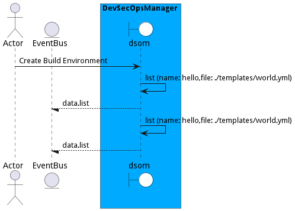

# Manage Environments

Manage Environments is the description

## Actors

* [DevOps Engineer](actor-devops)

## Detail Scenarios

* [CreateBuildEnvironment](#scenario-CreateBuildEnvironment)

### Scenario Create Build Environment

Create Build Environment is the description

#### Steps
1. [environment create --name build --file ./templates/environment.js](#action-environment create)

#### Actors

* [DevOps Engineer](actor-devops)

