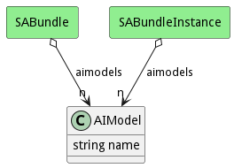

# AIModel

This represents an AIModel

## Attributes

* name:string - Name of the AIModel

## Associations

| Name | Cardinality | Class | Composition | Owner | Description |
| --- | --- | --- | --- | --- | --- |

## Users of the Model

| Name | Cardinality | Class | Composition | Owner | Description |
| --- | --- | --- | --- | --- | --- |
| aimodels | n | SABundle | false | false |  |
| aimodels | n | SABundleInstance | false | false |  |

## Methods

<h2>Method Details</h2>
    

