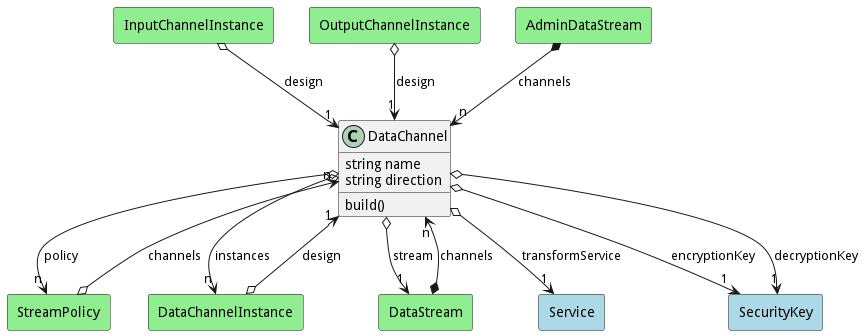
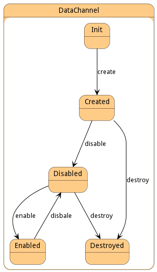

# DataChannel

This represents one channel in the data stream with specific rules for the channel.

## Attributes

* name:string - Data Channel Name
* direction:string - In or Out

## Associations

| Name | Cardinality | Class | Composition | Owner | Description |
| --- | --- | --- | --- | --- | --- |
| transformService | 1 | Service |  |  | This is the transformation service for the channel. It will summarize the data, give historical data, give all of the data as a passthru, or any other data transformation needed for the individual channel based on the policy applied to the data stream |
| policy | n | StreamPolicy |  |  | This policy is the policy that will create an instance of the data channel attached to a data stream. The policy defines how the channel is created and what transformation service to use when publishing or consuming information on the channel. |
| instances | n | DataChannelInstance |  |  | This is a collection of all of the instances of the data channel running in the system. |
| stream | 1 | DataStream |  |  | This is the owning stream |

## Users of the Model

| Name | Cardinality | Class | Composition | Owner | Description |
| --- | --- | --- | --- | --- | --- |
| design | 1 | DataChannelInstance |  |  | Parent of the channel Instance. This is the definition of the channel. |
| channels | n | DataStream | true | true | This is the collection of channel that are attached to this data stream |
| channels | n | StreamPolicy | false | false | This collection of channels that are used to create channel instances when the stream is created. |
| design | 1 | InputChannelInstance |  |  | Parent of the channel Instance. This is the definition of the channel. |
| design | 1 | OutputChannelInstance |  |  | Parent of the channel Instance. This is the definition of the channel. |

## State Net
The DataChannel has a state net corresponding to instances of the class. Each state transistion will emit an 
event that can be caught with a websocket client. The name of the event is the name of the state in all lower case.
The following diagram is the state net for this class.

| Name | Description | Events |
| --- | --- | --- |
| Init | Initial State | create-&gt;Created,  |
| Created | DataChannel is created | disable-&gt;Disabled, destroy-&gt;Destroyed,  |
| Disabled | DataChannel is disabled | enable-&gt;Enabled, destroy-&gt;Destroyed,  |
| Enabled | DataChannel is Enabled | disbale-&gt;Disabled,  |
| Destroyed | DataChannel is destroyed |  |

## Methods

<h2>Method Details</h2>
    

