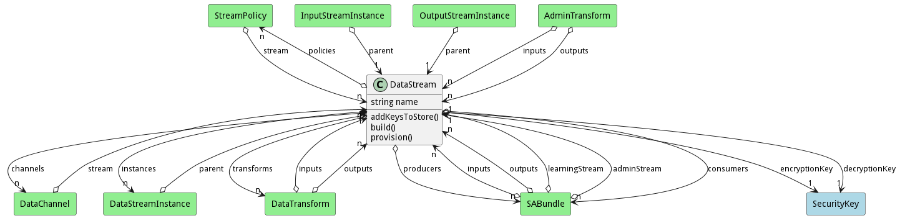
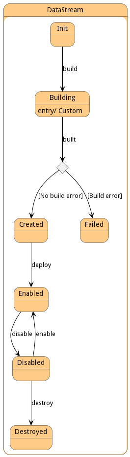

# DataStream

A Data stream defines where I am getting data from or pushing data.

## Attributes

* name:string - Name of the Data Stream

## Associations

| Name | Cardinality | Class | Composition | Owner | Description |
| --- | --- | --- | --- | --- | --- |
| policies | n | StreamPolicy | false | false | This is the collection policies that apply to the stream when the stream is created. |
| channels | n | DataChannel | true | true | This is the collection of channel that are attached to this data stream |
| instances | n | DataStreamInstance | false | true | This is the collection of deployed data streams in the system of this specific data stream. |
| transforms | n | DataTransform |  |  | This is the transformation that is called on data arriving to the Data Stream. |
| consumers | n | SABundle |  |  | This is a consumer of the data stream. |
| producers | n | SABundle |  |  | This is a producer of the data stream. |

## Users of the Model

| Name | Cardinality | Class | Composition | Owner | Description |
| --- | --- | --- | --- | --- | --- |
| stream | 1 | DataChannel |  |  | This is the owning stream |
| parent | 1 | DataStreamInstance |  |  | This is the parent of the data stream instance. |
| stream | n | StreamPolicy | false | false | This is the collection of streams that the policy is attached. The policy will only apply to the attached DataStreams. |
| inputs | n | DataTransform |  |  | Inputs of the transformation. |
| outputs | n | DataTransform |  |  | Outputs of the transformation. |
| inputs | n | SABundle | false | false | Input Data Streams for the SABR |
| outputs | n | SABundle | false | false | Output Data Streams for the SABR |
| learningInput | 1 | SABundle |  |  | Learning Corpus Input Stream receives updates to the aimodel |
| learningOutput | 1 | SABundle |  |  | Learning Corpus Output Stream receives updates to the aimodel |
| adminStream | 1 | SABundle |  |  | Administration Stream to handle registration of SABRS to Capabilities |
| admoutStream | 1 | SABundle |  |  | Administration Stream to handle registration of SABRS and Capabilities |
| parent | 1 | InputStreamInstance |  |  | This is the parent of the data stream instance. |
| parent | 1 | OutputStreamInstance |  |  | This is the parent of the data stream instance. |

## State Net
The DataStream has a state net corresponding to instances of the class. Each state transistion will emit an 
event that can be caught with a websocket client. The name of the event is the name of the state in all lower case.
The following diagram is the state net for this class.

| Name | Description | Events |
| --- | --- | --- |
| Init | Initial State | deploy-&gt;Created,  |
| Created | DataStream is created | disable-&gt;Disabled, destroy-&gt;Destroyed,  |
| Disabled | DataStream is disabled | enable-&gt;Enabled, destroy-&gt;Destroyed,  |
| Enabled | DataStream is Enabled | disbale-&gt;Disabled,  |
| Destroyed | DataStream is destroyed |  |

## Methods

* [deploy() - Deploy a Data Stream](#action-deploy)

<h2>Method Details</h2>
    
### Action datastream deploy

* REST - datastream/deploy?bundle=ref&amp;policies=ref
* bin - datastream deploy --bundle ref --policies ref
* js - datastream.deploy({ bundle:ref,policies:ref })

#### Description
Deploy a Data Stream

#### Parameters

| Name | Type | Required | Description |
|---|---|---|---|
| bundle | ref |true | Bundle Instance to attach the stream instances. |
| policies | ref |true | Policies to use for deploying the Bundle. |

