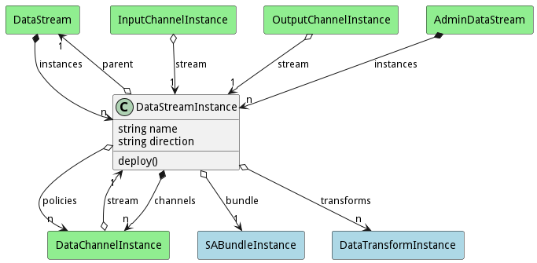
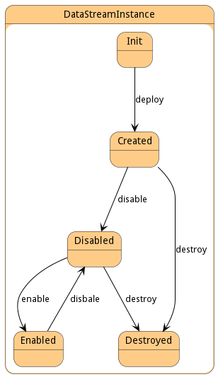

# DataStreamInstance

This represents a data stream that has been deployed and is running in the system.

## Attributes

* name:string - Name of the Data Stream
* direction:string - In or Out

## Associations

| Name | Cardinality | Class | Composition | Owner | Description |
| --- | --- | --- | --- | --- | --- |
| parent | 1 | DataStream |  |  | This is the parent of the data stream instance. |
| bundle | 1 | SABundleInstance |  |  | This is the Bundle instance that the data stream instance is connected. |
| channels | n | DataChannelInstance | true | true | This is the collection of channel instances that are attached to this data stream |
| policies | n | DataChannelInstance |  | false | This is the list of policies that are controlling the channels of the stream. They can come from the DataStream, the Resource, or the system overall. |
| transforms | n | DataTransformInstance |  | false | These are the transforms to run on the stream before it goes to the output streams. |

## Users of the Model

| Name | Cardinality | Class | Composition | Owner | Description |
| --- | --- | --- | --- | --- | --- |
| stream | 1 | DataChannelInstance |  |  | This is the stream instance that is running the channel |
| instances | n | DataStream | false | true | This is the collection of deployed data streams in the system of this specific data stream. |
| stream | 1 | InputChannelInstance |  |  | This is the stream instance that is running the channel |
| stream | 1 | OutputChannelInstance |  |  | This is the stream instance that is running the channel |

## State Net
The DataStreamInstance has a state net corresponding to instances of the class. Each state transistion will emit an 
event that can be caught with a websocket client. The name of the event is the name of the state in all lower case.
The following diagram is the state net for this class.

| Name | Description | Events |
| --- | --- | --- |
| Init | Initial State | deploy-&gt;Created,  |
| Created | DataStreamInstance is created | disable-&gt;Disabled, destroy-&gt;Destroyed,  |
| Disabled | DataStreamInstance is disabled | enable-&gt;Enabled, destroy-&gt;Destroyed,  |
| Enabled | DataStreamInstance is Enabled | disbale-&gt;Disabled,  |
| Destroyed | DataStreamInstance is destroyed |  |

## Methods

* [deploy() - Deploy a Data Stream Instance](#action-deploy)

<h2>Method Details</h2>
    
### Action datastreaminstance deploy

* REST - datastreaminstance/deploy?policies=ref
* bin - datastreaminstance deploy --policies ref
* js - datastreaminstance.deploy({ policies:ref })

#### Description
Deploy a Data Stream Instance

#### Parameters
| Name | Type | Required | Description |
|---|---|---|---|
| policies | ref |true | Policies to use for deploying the Bundle. |

