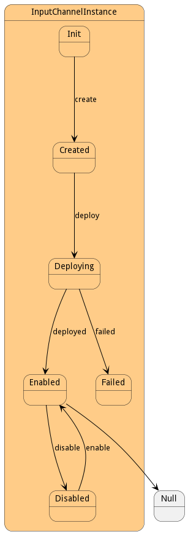

# InputChannelInstance

This is the input to the transformation. Also known as the consumer of the datastream.

## Attributes

* consumer:ref - This is the actual consumer of the datastream. It is implemented using Pulsar or kafka.
* name:string - Name of the data channel instance
* direction:string - 
* message:string - Message string from the failed state.

## Associations

| Name | Cardinality | Class | Composition | Owner | Description |
| --- | --- | --- | --- | --- | --- |
| transforms | n | DataTransform |  |  | Transformations to process when data arrives in this channel. |
| design | 1 | DataChannel |  |  | Parent of the channel Instance. This is the definition of the channel. |
| stream | 1 | DataStreamInstance |  |  | This is the stream instance that is running the channel |
| transformInstance | n | ServiceInstance |  |  | This is the instance of the transformation Service for the channel. |
| bundle | 1 | SABundleInstance |  |  | This is the sabr instance |

## Users of the Model

| Name | Cardinality | Class | Composition | Owner | Description |
| --- | --- | --- | --- | --- | --- |

## State Net

| Name | Description | Events |
| --- | --- | --- |
| Init | Initial State | create-&gt;Created,  |
| Created | The Channel is created but not connected to message queues | deploy-&gt;Deploying,  |
| Deploying | The channel is currently being deployed and connected to the message queues | deployed-&gt;Enabled, failed-&gt;Failed,  |
| Enabled | Channel can send information. | disable-&gt;Disabled,  |
| Disabled | Channel cannot send information. | enable-&gt;Enabled,  |
| Failed | State of the Channel if it failed to deploy! |  |

## Methods

* [create() - Create a Input Channel Instance](#action-create)

* [deploy() - Deploy the channel](#action-deploy)

* [failed() - Deployment Failed on the Data Channel Instance.](#action-failed)

<h2>Method Details</h2>
    
### Action inputchannelinstance create

* REST - inputchannelinstance/create
* bin - inputchannelinstance create
* js - inputchannelinstance.create

Create a Input Channel Instance

| Name | Type | Required | Description |
|---|---|---|---|

### Action inputchannelinstance deploy

* REST - inputchannelinstance/deploy
* bin - inputchannelinstance deploy
* js - inputchannelinstance.deploy

Deploy the channel

| Name | Type | Required | Description |
|---|---|---|---|

### Action inputchannelinstance failed

* REST - inputchannelinstance/failed
* bin - inputchannelinstance failed
* js - inputchannelinstance.failed

Deployment Failed on the Data Channel Instance.

| Name | Type | Required | Description |
|---|---|---|---|
| message | string |true | Failed Message for the deployment error. |

