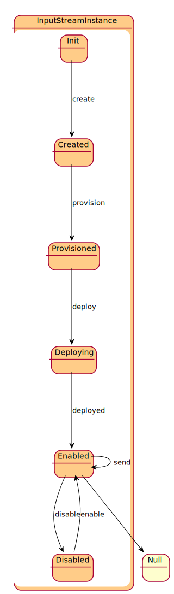

# InputStreamInstance

This is a specailization of the DataStreamInstance for producing output.

## Attributes

* consumer:ref - consumer that recieves data from the stream.
* name:string - Name of the Data Stream
* direction:string - In or Out

## Associations

| Name | Cardinality | Class | Composition | Owner | Description |
| --- | --- | --- | --- | --- | --- |
| parent | 1 | DataStream |  |  |  |
| bundle | 1 | SABundleInstance |  |  |  |
| channels | n | DataChannelInstance | true | true | This is the collection of channel instances that are attached to this data stream |
| policies | n | DataChannelInstance |  | false | This is the list of policies that are controlling the channels of the stream. They can come from the DataStream, the Resource, or the system overall. |
| transforms | n | DataTransformInstance |  | false | These are the transforms to run on the stream before it goes to the output streams. |

## Users of the Model

| Name | Cardinality | Class | Composition | Owner | Description |
| --- | --- | --- | --- | --- | --- |
| inputs | n | DataTransformInstance |  |  | Inputs of the transformation. |
| inputs | n | SABundleInstance | false | false | Input Data Streams for the SABR |
| learningInput | 1 | SABundleInstance |  |  | Learning Corpus Input Stream receives updates to the aimodel |
| adminStream | 1 | SABundleInstance |  |  | Administration Stream to handle registration of SABRS to Capabilities |
| inputs | n | DataTransformInstance |  |  | Inputs of the transformation. |
| inputs | n | SABundleInstance | false | false | Input Data Streams for the SABR |
| learningInput | 1 | SABundleInstance |  |  | Learning Corpus Input Stream receives updates to the aimodel |
| adminStream | 1 | SABundleInstance |  |  | Administration Stream to handle registration of SABRS to Capabilities |
| inputs | n | DataTransformInstance |  |  | Inputs of the transformation. |
| inputs | n | SABundleInstance | false | false | Input Data Streams for the SABR |
| learningInput | 1 | SABundleInstance |  |  | Learning Corpus Input Stream receives updates to the aimodel |
| adminStream | 1 | SABundleInstance |  |  | Administration Stream to handle registration of SABRS to Capabilities |
| inputs | n | DataTransformInstance |  |  | Inputs of the transformation. |
| inputs | n | SABundleInstance | false | false | Input Data Streams for the SABR |
| learningInput | 1 | SABundleInstance |  |  | Learning Corpus Input Stream receives updates to the aimodel |
| adminStream | 1 | SABundleInstance |  |  | Administration Stream to handle registration of SABRS to Capabilities |
| inputs | n | DataTransformInstance |  |  | Inputs of the transformation. |
| inputs | n | SABundleInstance | false | false | Input Data Streams for the SABR |
| learningInput | 1 | SABundleInstance |  |  | Learning Corpus Input Stream receives updates to the aimodel |
| adminStream | 1 | SABundleInstance |  |  | Administration Stream to handle registration of SABRS to Capabilities |
| inputs | n | DataTransformInstance |  |  | Inputs of the transformation. |
| inputs | n | SABundleInstance | false | false | Input Data Streams for the SABR |
| learningInput | 1 | SABundleInstance |  |  | Learning Corpus Input Stream receives updates to the aimodel |
| adminStream | 1 | SABundleInstance |  |  | Administration Stream to handle registration of SABRS to Capabilities |
| inputs | n | DataTransformInstance |  |  | Inputs of the transformation. |
| inputs | n | SABundleInstance | false | false | Input Data Streams for the SABR |
| learningInput | 1 | SABundleInstance |  |  | Learning Corpus Input Stream receives updates to the aimodel |
| adminStream | 1 | SABundleInstance |  |  | Administration Stream to handle registration of SABRS to Capabilities |
| inputs | n | DataTransformInstance |  |  | Inputs of the transformation. |
| inputs | n | SABundleInstance | false | false | Input Data Streams for the SABR |
| learningInput | 1 | SABundleInstance |  |  | Learning Corpus Input Stream receives updates to the aimodel |
| adminStream | 1 | SABundleInstance |  |  | Administration Stream to handle registration of SABRS to Capabilities |
| inputs | n | DataTransformInstance |  |  | Inputs of the transformation. |
| inputs | n | SABundleInstance | false | false | Input Data Streams for the SABR |
| learningInput | 1 | SABundleInstance |  |  | Learning Corpus Input Stream receives updates to the aimodel |
| adminStream | 1 | SABundleInstance |  |  | Administration Stream to handle registration of SABRS to Capabilities |
| inputs | n | DataTransformInstance |  |  | Inputs of the transformation. |
| inputs | n | SABundleInstance | false | false | Input Data Streams for the SABR |
| learningInput | 1 | SABundleInstance |  |  | Learning Corpus Input Stream receives updates to the aimodel |
| adminStream | 1 | SABundleInstance |  |  | Administration Stream to handle registration of SABRS to Capabilities |
| inputs | n | DataTransformInstance |  |  | Inputs of the transformation. |
| inputs | n | SABundleInstance | false | false | Input Data Streams for the SABR |
| learningInput | 1 | SABundleInstance |  |  | Learning Corpus Input Stream receives updates to the aimodel |
| adminStream | 1 | SABundleInstance |  |  | Administration Stream to handle registration of SABRS to Capabilities |
| inputs | n | DataTransformInstance |  |  | Inputs of the transformation. |
| inputs | n | SABundleInstance | false | false | Input Data Streams for the SABR |
| learningInput | 1 | SABundleInstance |  |  | Learning Corpus Input Stream receives updates to the aimodel |
| adminStream | 1 | SABundleInstance |  |  | Administration Stream to handle registration of SABRS to Capabilities |
| inputs | n | DataTransformInstance |  |  | Inputs of the transformation. |
| inputs | n | SABundleInstance | false | false | Input Data Streams for the SABR |
| learningInput | 1 | SABundleInstance |  |  | Learning Corpus Input Stream receives updates to the aimodel |
| adminStream | 1 | SABundleInstance |  |  | Administration Stream to handle registration of SABRS to Capabilities |
| inputs | n | DataTransformInstance |  |  | Inputs of the transformation. |
| inputs | n | SABundleInstance | false | false | Input Data Streams for the SABR |
| learningInput | 1 | SABundleInstance |  |  | Learning Corpus Input Stream receives updates to the aimodel |
| adminStream | 1 | SABundleInstance |  |  | Administration Stream to handle registration of SABRS to Capabilities |
| inputs | n | DataTransformInstance |  |  | Inputs of the transformation. |
| inputs | n | SABundleInstance | false | false | Input Data Streams for the SABR |
| learningInput | 1 | SABundleInstance |  |  | Learning Corpus Input Stream receives updates to the aimodel |
| adminStream | 1 | SABundleInstance |  |  | Administration Stream to handle registration of SABRS to Capabilities |

## State Net

| Name | Description | Events |
| --- | --- | --- |
| Init | Initial State | create-&gt;Created,  |
| Created | Stream Instance created but not connected. | deploy-&gt;Deploying,  |
| Deploying | Stream Instance is connecting to the message queues | deployed-&gt;Enabled,  |
| Enabled | Stream Instance is ready to receive information to the message queues. | disable-&gt;Disabled, send-&gt;Enabled,  |
| Disabled | Stream Instance cannot receive information at this time and no transformations are working. | enable-&gt;Enabled,  |

## Methods

* [deploy() - Deploy a Data Stream Instance](#action-deploy)

* [process() - Process data on the channel](#action-process)

<h2>Method Details</h2>
    
### Action inputstreaminstance deploy

* REST - inputstreaminstance/deploy
* bin - inputstreaminstance deploy
* js - inputstreaminstance.deploy

Deploy a Data Stream Instance

| Name | Type | Required | Description |
|---|---|---|---|
| policies | ref |true | Policies to use for deploying the Bundle. |

### Action inputstreaminstance process

* REST - inputstreaminstance/process
* bin - inputstreaminstance process
* js - inputstreaminstance.process

Process data on the channel

| Name | Type | Required | Description |
|---|---|---|---|
| data | json |true | Data to process. |
| properties | json |true | Properties of the data |
| channel | ref |true | Channel the data came on |

