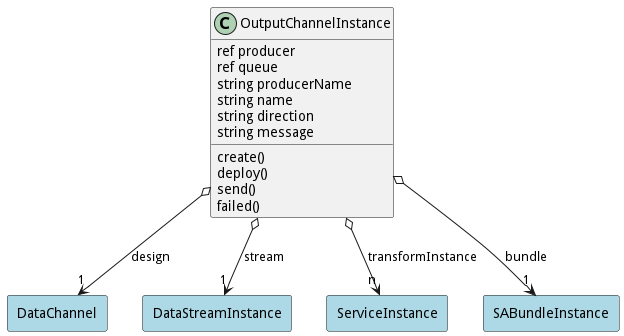
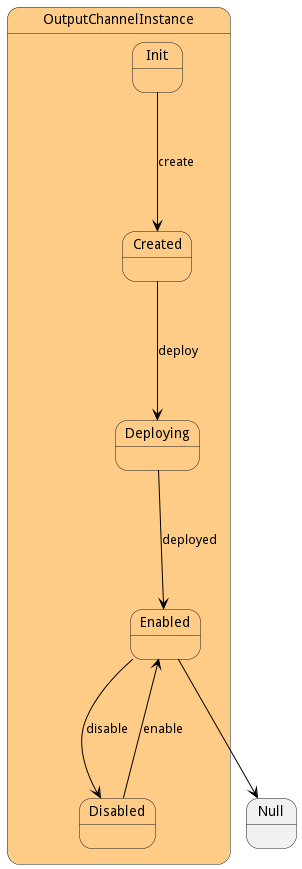

# OutputChannelInstance

This is the producer to the data stream. Data is flowing out of the transformation.

## Attributes

* producer:ref - This is the reference to the producer. This can be implemented with pulsar or kafka.
* queue:ref - This contains an array of inputs that are backed up due to channel closure.
* producerName:string - This is the name of the pulsar producer
* name:string - Name of the data channel instance
* direction:string - 
* message:string - Message string from the failed state.

## Associations

| Name | Cardinality | Class | Composition | Owner | Description |
| --- | --- | --- | --- | --- | --- |
| design | 1 | DataChannel |  |  | Parent of the channel Instance. This is the definition of the channel. |
| stream | 1 | DataStreamInstance |  |  | This is the stream instance that is running the channel |
| transformInstance | n | ServiceInstance |  |  | This is the instance of the transformation Service for the channel. |
| bundle | 1 | SABundleInstance |  |  | This is the sabr instance |

## State Net
The OutputChannelInstance has a state net corresponding to instances of the class. Each state transistion will emit an 
event that can be caught with a websocket client. The name of the event is the name of the state in all lower case.
The following diagram is the state net for this class.

| Name | Description | Events |
| --- | --- | --- |
| Init | Initial State | create-&gt;Created,  |
| Created | The Channel is created but not connected to message queues | deploy-&gt;Deploying,  |
| Deploying | The channel is currently being deployed and connected to the message queues | deployed-&gt;Enabled, failed-&gt;Failed,  |
| Enabled | Channel can send information. | disable-&gt;Disabled,  |
| Disabled | Channel cannot send information. | enable-&gt;Enabled,  |
| Failed | Channel failed to deploy. |  |

## Methods
* [create() - Create a Output Channel Instance](#action-create)
* [deploy() - Deploy the output channel instance](#action-deploy)
* [send() - Send data to the Data Stream Instance](#action-send)
* [failed() - Deployment Failed on the Data Channel Instance.](#action-failed)

<h2>Method Details</h2>
    
### Action outputchannelinstance create

* REST - outputchannelinstance/create?
* bin - outputchannelinstance create 
* js - outputchannelinstance.create({  })

#### Description
Create a Output Channel Instance

#### Parameters

No parameters

### Action outputchannelinstance deploy

* REST - outputchannelinstance/deploy?
* bin - outputchannelinstance deploy 
* js - outputchannelinstance.deploy({  })

#### Description
Deploy the output channel instance

#### Parameters

No parameters

### Action outputchannelinstance send

* REST - outputchannelinstance/send?data=json&amp;properties=json
* bin - outputchannelinstance send --data json --properties json
* js - outputchannelinstance.send({ data:json,properties:json })

#### Description
Send data to the Data Stream Instance

#### Parameters

| Name | Type | Required | Description |
|---|---|---|---|
| data | json |true | Data to send to the data stream |
| properties | json |true | Properties of the data being sent. |

### Action outputchannelinstance failed

* REST - outputchannelinstance/failed?message=string
* bin - outputchannelinstance failed --message string
* js - outputchannelinstance.failed({ message:string })

#### Description
Deployment Failed on the Data Channel Instance.

#### Parameters

| Name | Type | Required | Description |
|---|---|---|---|
| message | string |true | Failed Message for the deployment error. |

