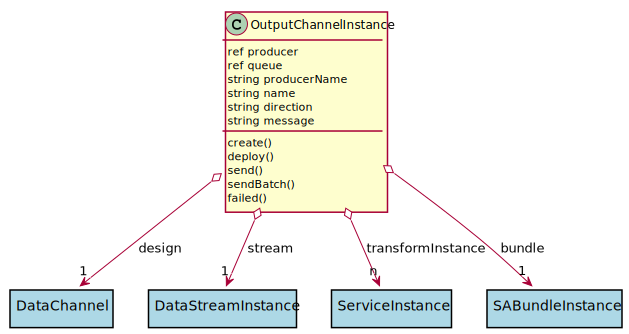

# OutputChannelInstance

This is the producer to the data stream. Data is flowing out of the transformation.

## Attributes

* producer:ref - This is the reference to the producer. This can be implemented with pulsar or kafka.
* queue:ref - This contains an array of inputs that are backed up due to channel closure.
* producerName:string - This is the name of the pulsar producer
* name:string - Name of the data channel instance
* direction:string - 
* message:string - Message string from the failed state.

## Associations

| Name | Cardinality | Class | Composition | Owner | Description |
| --- | --- | --- | --- | --- | --- |
| design | 1 | DataChannel |  |  | Parent of the channel Instance. This is the definition of the channel. |
| stream | 1 | DataStreamInstance |  |  | This is the stream instance that is running the channel |
| transformInstance | n | ServiceInstance |  |  | This is the instance of the transformation Service for the channel. |
| bundle | 1 | SABundleInstance |  |  | This is the sabr instance |

## Users of the Model

| Name | Cardinality | Class | Composition | Owner | Description |
| --- | --- | --- | --- | --- | --- |

## State Net

| Name | Description | Events |
| --- | --- | --- |
| Init | Initial State | create-&gt;Created,  |
| Created | The Channel is created but not connected to message queues | deploy-&gt;Deploying,  |
| Deploying | The channel is currently being deployed and connected to the message queues | deployed-&gt;Enabled,  |
| Enabled | Channel can send information. | disable-&gt;Disabled, send-&gt;undefined,  |
| Disabled | Channel cannot send information. | enable-&gt;Enabled,  |

## Methods

* [create() - Create a Output Channel Instance](#action-create)

* [deploy() - Deploy the channel](#action-deploy)

* [send() - Send data to the Data Stream Instance](#action-send)

* [failed() - Deployment Failed on the Data Channel Instance.](#action-failed)

<h2>Method Details</h2>
    
### Action outputchannelinstance create

* REST - outputchannelinstance/create
* bin - outputchannelinstance create
* js - outputchannelinstance.create

Create a Output Channel Instance

| Name | Type | Required | Description |
|---|---|---|---|

### Action outputchannelinstance deploy

* REST - outputchannelinstance/deploy
* bin - outputchannelinstance deploy
* js - outputchannelinstance.deploy

Deploy the channel

| Name | Type | Required | Description |
|---|---|---|---|

### Action outputchannelinstance send

* REST - outputchannelinstance/send
* bin - outputchannelinstance send
* js - outputchannelinstance.send

Send data to the Data Stream Instance

| Name | Type | Required | Description |
|---|---|---|---|
| data | json |true | Data to send to the data stream |
| properties | json |true | Properties of the data being sent. |

### Action outputchannelinstance failed

* REST - outputchannelinstance/failed
* bin - outputchannelinstance failed
* js - outputchannelinstance.failed

Deployment Failed on the Data Channel Instance.

| Name | Type | Required | Description |
|---|---|---|---|
| message | string |true | Failed Message for the deployment error. |

