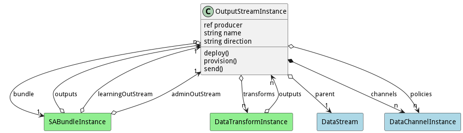
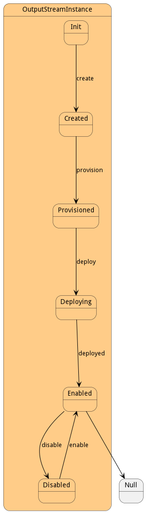

# OutputStreamInstance

This is a specialization of the DataStreamInstance for producing output.

## Attributes

* producer:ref - This is the producer send output.
* name:string - Name of the Data Stream
* direction:string - In or Out

## Associations

| Name | Cardinality | Class | Composition | Owner | Description |
| --- | --- | --- | --- | --- | --- |
| parent | 1 | DataStream |  |  | This is the parent of the data stream instance. |
| bundle | 1 | SABundleInstance |  |  | This is the Bundle instance that the data stream instance is connected. |
| channels | n | DataChannelInstance | true | true | This is the collection of channel instances that are attached to this data stream |
| policies | n | DataChannelInstance |  | false | This is the list of policies that are controlling the channels of the stream. They can come from the DataStream, the Resource, or the system overall. |
| transforms | n | DataTransformInstance |  | false | These are the transforms to run on the stream before it goes to the output streams. |

## Users of the Model

| Name | Cardinality | Class | Composition | Owner | Description |
| --- | --- | --- | --- | --- | --- |
| outputs | n | DataTransformInstance |  |  | Outputs of the transformation. |
| outputs | n | SABundleInstance | false | false | Output Data Streams for the SABR |
| learningOutput | 1 | SABundleInstance |  |  | Learning Corpus Output Stream receives updates to the aimodel |
| admoutStream | 1 | SABundleInstance |  |  | Administration Stream to handle registration of SABRS and Capabilities |

## State Net
The OutputStreamInstance has a state net corresponding to instances of the class. Each state transistion will emit an 
event that can be caught with a websocket client. The name of the event is the name of the state in all lower case.
The following diagram is the state net for this class.

| Name | Description | Events |
| --- | --- | --- |
| Init | Initial State | create-&gt;Created,  |
| Created | Stream Instance created but not connected. | deploy-&gt;Deploying,  |
| Deploying | Stream Instance is connecting to the message queues | deployed-&gt;Enabled,  |
| Enabled | Stream Instance is ready to send information to the message queues. | disable-&gt;Disabled, send-&gt;Enabled,  |
| Disabled | Stream Instance cannot send information at this time and no transformations are working. | enable-&gt;Enabled,  |

## Methods

* [deploy() - Deploy a Data Stream Instance](#action-deploy)

* [send() - Send data to the Data Stream Instance](#action-send)

<h2>Method Details</h2>
    
### Action outputstreaminstance deploy

* REST - outputstreaminstance/deploy?policies=ref
* bin - outputstreaminstance deploy --policies ref
* js - outputstreaminstance.deploy({ policies:ref })

#### Description
Deploy a Data Stream Instance

#### Parameters

| Name | Type | Required | Description |
|---|---|---|---|
| policies | ref |true | Policies to use for deploying the Bundle. |

### Action outputstreaminstance send

* REST - outputstreaminstance/send?data=json&amp;properties=json
* bin - outputstreaminstance send --data json --properties json
* js - outputstreaminstance.send({ data:json,properties:json })

#### Description
Send data to the Data Stream Instance

#### Parameters

| Name | Type | Required | Description |
|---|---|---|---|
| data | json |true | Data to send to the data stream |
| properties | json |true | Properties of the data being sent. |

