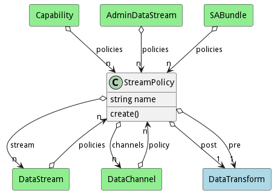

# StreamPolicy

The Stream Policy takes the Data Stream and creates Data Channels based on the policies

## Attributes

* name:string - Name of the policy

## Associations

| Name | Cardinality | Class | Composition | Owner | Description |
| --- | --- | --- | --- | --- | --- |
| post | 1 | DataTransform |  |  | This is the transform to run after all of the transformation and before sending out. |
| pre | 1 | DataTransform |  |  | This is the transform to run after all of the transformation and before sending out. |
| stream | n | DataStream | false | false | This is the collection of streams that the policy is attached. The policy will only apply to the attached DataStreams. |
| channels | n | DataChannel | false | false | This collection of channels that are used to create channel instances when the stream is created. |

## Users of the Model

| Name | Cardinality | Class | Composition | Owner | Description |
| --- | --- | --- | --- | --- | --- |
| policies | n | Capability |  |  | Policies to apply to the bundles when they are deployed. |
| policy | n | DataChannel |  |  | This policy is the policy that will create an instance of the data channel attached to a data stream. The policy defines how the channel is created and what transformation service to use when publishing or consuming information on the channel. |
| policies | n | DataStream | false | false | This is the collection policies that apply to the stream when the stream is created. |
| policies | n | Capability |  |  | Policies to apply to the bundles when they are deployed. |
| policy | n | DataChannel |  |  | This policy is the policy that will create an instance of the data channel attached to a data stream. The policy defines how the channel is created and what transformation service to use when publishing or consuming information on the channel. |
| policies | n | DataStream | false | false | This is the collection policies that apply to the stream when the stream is created. |
| policies | n | Capability |  |  | Policies to apply to the bundles when they are deployed. |
| policy | n | DataChannel |  |  | This policy is the policy that will create an instance of the data channel attached to a data stream. The policy defines how the channel is created and what transformation service to use when publishing or consuming information on the channel. |
| policies | n | DataStream | false | false | This is the collection policies that apply to the stream when the stream is created. |
| policies | n | Capability |  |  | Policies to apply to the bundles when they are deployed. |
| policy | n | DataChannel |  |  | This policy is the policy that will create an instance of the data channel attached to a data stream. The policy defines how the channel is created and what transformation service to use when publishing or consuming information on the channel. |
| policies | n | DataStream | false | false | This is the collection policies that apply to the stream when the stream is created. |
| policies | n | Capability |  |  | Policies to apply to the bundles when they are deployed. |
| policy | n | DataChannel |  |  | This policy is the policy that will create an instance of the data channel attached to a data stream. The policy defines how the channel is created and what transformation service to use when publishing or consuming information on the channel. |
| policies | n | DataStream | false | false | This is the collection policies that apply to the stream when the stream is created. |
| policies | n | Capability |  |  | Policies to apply to the bundles when they are deployed. |
| policy | n | DataChannel |  |  | This policy is the policy that will create an instance of the data channel attached to a data stream. The policy defines how the channel is created and what transformation service to use when publishing or consuming information on the channel. |
| policies | n | DataStream | false | false | This is the collection policies that apply to the stream when the stream is created. |
| policies | n | Capability |  |  | Policies to apply to the bundles when they are deployed. |
| policy | n | DataChannel |  |  | This policy is the policy that will create an instance of the data channel attached to a data stream. The policy defines how the channel is created and what transformation service to use when publishing or consuming information on the channel. |
| policies | n | DataStream | false | false | This is the collection policies that apply to the stream when the stream is created. |
| policies | n | Capability |  |  | Policies to apply to the bundles when they are deployed. |
| policy | n | DataChannel |  |  | This policy is the policy that will create an instance of the data channel attached to a data stream. The policy defines how the channel is created and what transformation service to use when publishing or consuming information on the channel. |
| policies | n | DataStream | false | false | This is the collection policies that apply to the stream when the stream is created. |
| policies | n | Capability |  |  | Policies to apply to the bundles when they are deployed. |
| policy | n | DataChannel |  |  | This policy is the policy that will create an instance of the data channel attached to a data stream. The policy defines how the channel is created and what transformation service to use when publishing or consuming information on the channel. |
| policies | n | DataStream | false | false | This is the collection policies that apply to the stream when the stream is created. |
| policies | n | Capability |  |  | Policies to apply to the bundles when they are deployed. |
| policy | n | DataChannel |  |  | This policy is the policy that will create an instance of the data channel attached to a data stream. The policy defines how the channel is created and what transformation service to use when publishing or consuming information on the channel. |
| policies | n | DataStream | false | false | This is the collection policies that apply to the stream when the stream is created. |
| policies | n | Capability |  |  | Policies to apply to the bundles when they are deployed. |
| policy | n | DataChannel |  |  | This policy is the policy that will create an instance of the data channel attached to a data stream. The policy defines how the channel is created and what transformation service to use when publishing or consuming information on the channel. |
| policies | n | DataStream | false | false | This is the collection policies that apply to the stream when the stream is created. |
| policies | n | Capability |  |  | Policies to apply to the bundles when they are deployed. |
| policy | n | DataChannel |  |  | This policy is the policy that will create an instance of the data channel attached to a data stream. The policy defines how the channel is created and what transformation service to use when publishing or consuming information on the channel. |
| policies | n | DataStream | false | false | This is the collection policies that apply to the stream when the stream is created. |
| policies | n | Capability |  |  | Policies to apply to the bundles when they are deployed. |
| policy | n | DataChannel |  |  | This policy is the policy that will create an instance of the data channel attached to a data stream. The policy defines how the channel is created and what transformation service to use when publishing or consuming information on the channel. |
| policies | n | DataStream | false | false | This is the collection policies that apply to the stream when the stream is created. |
| policies | n | Capability |  |  | Policies to apply to the bundles when they are deployed. |
| policy | n | DataChannel |  |  | This policy is the policy that will create an instance of the data channel attached to a data stream. The policy defines how the channel is created and what transformation service to use when publishing or consuming information on the channel. |
| policies | n | DataStream | false | false | This is the collection policies that apply to the stream when the stream is created. |
| policies | n | Capability |  |  | Policies to apply to the bundles when they are deployed. |
| policy | n | DataChannel |  |  | This policy is the policy that will create an instance of the data channel attached to a data stream. The policy defines how the channel is created and what transformation service to use when publishing or consuming information on the channel. |
| policies | n | DataStream | false | false | This is the collection policies that apply to the stream when the stream is created. |

## State Net

| Name | Description | Events |
| --- | --- | --- |
| Init | Initial State | create-&gt;Created,  |
| Created | Stream is created | disable-&gt;Disabled, destroy-&gt;Destroyed,  |
| Disabled | Stream is disabled | enable-&gt;Enabled, destroy-&gt;Destroyed,  |
| Enabled | Stream is Enabled | disbale-&gt;Disabled,  |
| Destroyed | Stream is destroyed |  |

## Methods

* [create() - Create a Sentient Agent Bundle](#action-create)

<h2>Method Details</h2>
    
### Action streampolicy create

* REST - streampolicy/create
* bin - streampolicy create
* js - streampolicy.create

Create a Sentient Agent Bundle

| Name | Type | Required | Description |
|---|---|---|---|
| name | string |true | name of the Sentient Agent Bundle |
| file | file |false | file with the definition |

