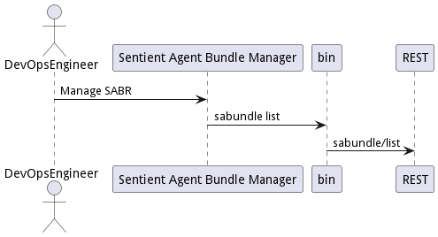
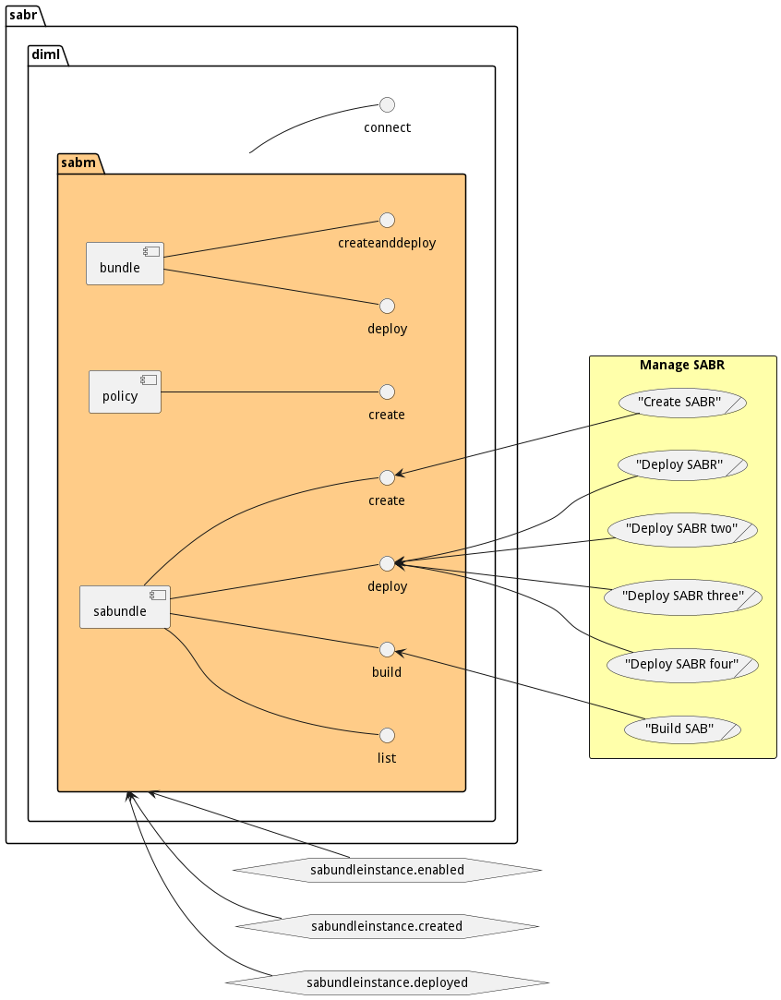
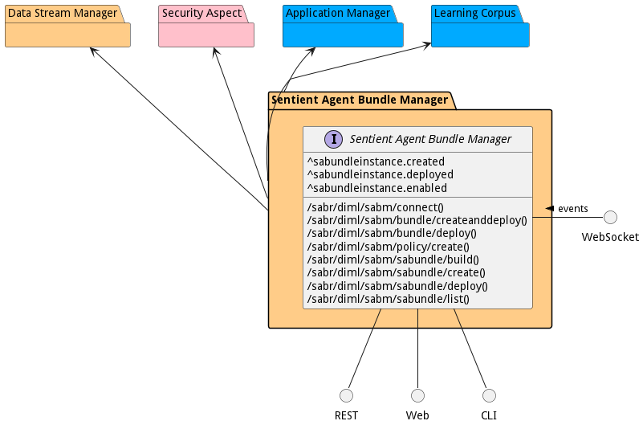
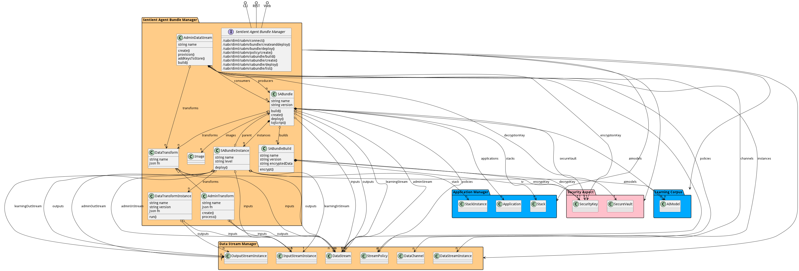

# Sentient Agent Bundle Manager

Sentient Agent Bundle Manager is a package that contains the definition to manage data streams,data transformation, and the deployment of those bundles.

#

## Self decrypting repository and launcher

* The image that gets deployed is a self encrypted repo that has all of the images for the SABR to run properly 
  including the stream manager, application images, AI volumes, etc..
* When the SAB image gets created all of the images are already in the registry that was created specifically for 
  the build. Then the /var/lib/registry is encrypted and put into the base docker image. which is a registry image. 
  This has to be the case because there is no connectivity to a central repo when the SAB is deployed. Everything 
  must be self contained.
### Building a SAB
1. Create a temporary volume for the registry (tempreg)
1. <strike>Start a build registry with the volume mounted to /var/lib/registry</Strike> - Not Needed
1. Build all of the images that will be going into the SAB
1. <Strike>Push the images to the build registry</strike>
1. <Strike>stop and remove the build registry</strike>
1. save the images with docker save > image.tar
1. <strike>encrypt the temporary volume for the registry (tmpreg) create one file tmpreg.enc</strike>
1. encrypt the image.tar files
1. Build the SAB image 
   1. SAB image is a combination of <strike>registry</strike>, node:alpine, docker:alpine
   1. Copy tmpreg.enc copied into the SAB image
   1. Copy the init.js script into the SAB image
   1. Copy the package.json into the SAB image
   1. Copy new entrypoint.sh into the SAB image
   1. entrypoint should be changed to entrypoint.sh
1. Save the docker image to a compress tar file with docker save

### Deploying a SAB
1. transfer the docker image to the target device in a *.tar.gz file
1. load the docker image with docker load
1. start the container with the SAB image
   1. Check to see if the device is attested to this SAB
   1. Decrypt the tmpreg.enc
   1. <strike>Start the registry in the background</strike>
   1. load the image.tar files using the docker load command.
   1. call the entrypoint.sh file. This should deploy the images using a swarm or compose file depending on the method.

    
Note: Registry may not be needed to load the images. Using docker save and docker load. 

## Use Cases

The following are the use cases of the Sentient Agent Bundle Manager subsystem. Each use case has primary and secondary scenarios
that are elaborated in the use case descriptions.

* [Manage SABR](usecase-ManageSABR)

## Users

The following are the actors of the Sentient Agent Bundle Manager subsystem. This can include people, other subsystems
inside the solution and even external subsystems.

* [DevOpsEngineer](actor-devops)

## Interface

The subsystem has a REST, CLI, WebSocket, and Web interface. Use Cases and Scenarios can use any or all
of the interfaces to perform the work that needs to be completed. The following  diagram shows how
users interact with the system.

* [ sabr diml sabm connect](#action--sabr-diml-sabm-connect)
* [ sabr diml sabm bundle createanddeploy](#action--sabr-diml-sabm-bundle-createanddeploy)
* [ sabr diml sabm bundle deploy](#action--sabr-diml-sabm-bundle-deploy)
* [ sabr diml sabm policy create](#action--sabr-diml-sabm-policy-create)
* [ sabr diml sabm sabundle build](#action--sabr-diml-sabm-sabundle-build)
* [ sabr diml sabm sabundle create](#action--sabr-diml-sabm-sabundle-create)
* [ sabr diml sabm sabundle deploy](#action--sabr-diml-sabm-sabundle-deploy)
* [ sabr diml sabm sabundle list](#action--sabr-diml-sabm-sabundle-list)

## Logical Artifacts

The Data Model for the  Sentient Agent Bundle Manager subsystem shows how the different objects and classes of object interact
and their structure.

### Sub Packages

The Sentient Agent Bundle Manager subsystem has sub packages as well. These subsystems are logical components to better
organize the architecture and make it easier to analyze, understand, design, and implement.

### Classes

The following are the classes in the data model of the Sentient Agent Bundle Manager subsystem.

* [AdminDataStream](class-AdminDataStream)
* [AdminTransform](class-AdminTransform)
* [DataTransform](class-DataTransform)
* [DataTransformInstance](class-DataTransformInstance)
* [SABundle](class-SABundle)
* [SABundleBuild](class-SABundleBuild)
* [SABundleInstance](class-SABundleInstance)

## Deployment Architecture

This subsystem is deployed using micro-services as shown in the diagram below. The 'micro' module is
used to implement the micro-services in the system. The subsystem also has an CLI, REST and Web Interface
exposed through a nodejs application. The nodejs application will interface with the micro-services and
can monitor and drive work-flows through the mesh of micro-services. The deployment of the subsystem is
dependent on the environment it is deployed. This subsystem has the following environments:
* [dev](environment--sabr-diml-sabm-dev)
* [test](environment--sabr-diml-sabm-test)
* [prod](environment--sabr-diml-sabm-prod)

## Physical Architecture

The Sentient Agent Bundle Manager subsystem is physically laid out on a hybrid cloud infrastructure. Each microservice belongs
to a secure micro-segmented network. All of the micro-services communicate to each other and the main app through a
REST interface. A Command Line Interface (CLI), REST or Web User interface for the app is how other subsystems or actors
interact. Requests are forwarded to micro-services through the REST interface of each micro-service. The subsystem has
the a unique layout based on the environment the physical space. The following are the environments for this
subsystems.
* [dev](environment--sabr-diml-sabm-dev)
* [test](environment--sabr-diml-sabm-test)
* [prod](environment--sabr-diml-sabm-prod)

## Micro-Services

These are the micro-services for the subsystem. The combination of the micro-services help implement
the subsystem's logic.

### dev

Detail information for the [dev environment](environment--sabr-diml-sabm-dev)
can be found [here](environment--sabr-diml-sabm-dev)

Services in the dev environment

* sabr : sabr_diml_sabm_sabr
* web : sabr_diml_sabm_web
* pulsar : sabr_diml_dsm_pulsar

### test

Detail information for the [test environment](environment--sabr-diml-sabm-test)
can be found [here](environment--sabr-diml-sabm-test)

Services in the test environment

### prod

Detail information for the [prod environment](environment--sabr-diml-sabm-prod)
can be found [here](environment--sabr-diml-sabm-prod)

Services in the prod environment

* sabr : sabr_diml_sabm_sabr
* web : sabr_diml_sabm_web
* pulsar : sabr_diml_dsm_pulsar

## Activities and Flows
The Sentient Agent Bundle Manager subsystem provides the following activities and flows that help satisfy the use
cases and scenarios of the subsystem.

### Messages Handled

The Sentient Agent Bundle Manager subsystem is an event driven architecture and handle several events. The following
events are handled by this subsystem. Please note that this subsystem is not the only subsystem that handles
these events.

| Message | Action | Description |
| --- | --- | --- |
| sabundleinstance.created | Custom Action |  |
| sabundleinstance.deployed | Custom Action |  |
| sabundleinstance.enabled | Custom Action |  |

### Messages Sent

| Event | Description | Emitter |
|-------|-------------|---------|
| admindatastream.create |  When an object of type AdminDataStream is created. | AdminDataStream
| admindatastream.destroy |  When an object of type AdminDataStream is destroyed. | AdminDataStream
| admindatastream.updated |  When an object of type AdminDataStream has an attribute or association updated. | AdminDataStream
| admintransform.create |  When an object of type AdminTransform is created. | AdminTransform
| admintransform.destroy |  When an object of type AdminTransform is destroyed. | AdminTransform
| admintransform.updated |  When an object of type AdminTransform has an attribute or association updated. | AdminTransform
| datatransform.create |  When an object of type DataTransform is created. | DataTransform
| datatransform.destroy |  When an object of type DataTransform is destroyed. | DataTransform
| datatransform.updated |  When an object of type DataTransform has an attribute or association updated. | DataTransform
| datatransforminstance.create |  When an object of type DataTransformInstance is created. | DataTransformInstance
| datatransforminstance.destroy |  When an object of type DataTransformInstance is destroyed. | DataTransformInstance
| datatransforminstance.updated |  When an object of type DataTransformInstance has an attribute or association updated. | DataTransformInstance
| sabundle.create |  When an object of type SABundle is created. | SABundle
| sabundle.destroy |  When an object of type SABundle is destroyed. | SABundle
| sabundle.updated |  When an object of type SABundle has an attribute or association updated. | SABundle
| sabundlebuild.create |  When an object of type SABundleBuild is created. | SABundleBuild
| sabundlebuild.destroy |  When an object of type SABundleBuild is destroyed. | SABundleBuild
| sabundlebuild.updated |  When an object of type SABundleBuild has an attribute or association updated. | SABundleBuild
| sabundleinstance.create |  When an object of type SABundleInstance is created. | SABundleInstance
| sabundleinstance.destroy |  When an object of type SABundleInstance is destroyed. | SABundleInstance
| sabundleinstance.updated |  When an object of type SABundleInstance has an attribute or association updated. | SABundleInstance

## Interface Details
The Sentient Agent Bundle Manager subsystem has a well defined interface. This interface can be accessed using a
command line interface (CLI), REST interface, and Web user interface. This interface is how all other
subsystems and actors can access the system.

### Action  sabr diml sabm connect

* REST - /sabr/diml/sabm/connect?sabr=string&amp;level=string
* bin -  sabr diml sabm connect --sabr string --level string
* js - .sabr.diml.sabm.connect({ sabr:string,level:string })

#### Description
Set the level of operation

#### Parameters

| Name | Type | Required | Description |
|---|---|---|---|
| sabr | string |true | The SABR to set the level |
| level | string |true | The Level to set the SABR |

### Action  sabr diml sabm bundle createanddeploy

* REST - /sabr/diml/sabm/bundle/createanddeploy?name=string&amp;file=file&amp;policies=file
* bin -  sabr diml sabm bundle createanddeploy --name string --file file --policies file
* js - .sabr.diml.sabm.bundle.createanddeploy({ name:string,file:file,policies:file })

#### Description
Create and deploy the bundle

#### Parameters

| Name | Type | Required | Description |
|---|---|---|---|
| name | string |true | name of the Sentient Agent Bundle |
| file | file |true | file with the definition |
| policies | file |true | The name of the policies to use in the deployment. Comma separated |

### Action  sabr diml sabm bundle deploy

* REST - /sabr/diml/sabm/bundle/deploy?sabr=string&amp;policies=string&amp;parameters=string
* bin -  sabr diml sabm bundle deploy --sabr string --policies string --parameters string
* js - .sabr.diml.sabm.bundle.deploy({ sabr:string,policies:string,parameters:string })

#### Description
Deploy the bundle

#### Parameters

| Name | Type | Required | Description |
|---|---|---|---|
| sabr | string |true | The name of the SABR |
| policies | string |true | The name of the policies to use in the deployment. Comma separated |
| parameters | string |false | Parameters used for the instance deployment |

### Action  sabr diml sabm policy create

* REST - /sabr/diml/sabm/policy/create?file=file
* bin -  sabr diml sabm policy create --file file
* js - .sabr.diml.sabm.policy.create({ file:file })

#### Description
Description of the action

#### Parameters

| Name | Type | Required | Description |
|---|---|---|---|
| file | file |false | Description for the parameter |

### Action  sabr diml sabm sabundle build

* REST - /sabr/diml/sabm/sabundle/build?name=string&amp;id=string
* bin -  sabr diml sabm sabundle build --name string --id string
* js - .sabr.diml.sabm.sabundle.build({ name:string,id:string })

#### Description
Build the SAB with all of the elements including encrypting the bundle and the vault.

#### Parameters

| Name | Type | Required | Description |
|---|---|---|---|
| name | string |false | The name of the Bundle. |
| id | string |false | The id of the build. |

### Action  sabr diml sabm sabundle create

* REST - /sabr/diml/sabm/sabundle/create?attr1=string
* bin -  sabr diml sabm sabundle create --attr1 string
* js - .sabr.diml.sabm.sabundle.create({ attr1:string })

#### Description
Description of the action

#### Parameters

| Name | Type | Required | Description |
|---|---|---|---|
| attr1 | string |false | Description for the parameter |

### Action  sabr diml sabm sabundle deploy

* REST - /sabr/diml/sabm/sabundle/deploy?attr1=string
* bin -  sabr diml sabm sabundle deploy --attr1 string
* js - .sabr.diml.sabm.sabundle.deploy({ attr1:string })

#### Description
Description of the action

#### Parameters

| Name | Type | Required | Description |
|---|---|---|---|
| attr1 | string |false | Description for the parameter |

### Action  sabr diml sabm sabundle list

* REST - /sabr/diml/sabm/sabundle/list?attr1=string
* bin -  sabr diml sabm sabundle list --attr1 string
* js - .sabr.diml.sabm.sabundle.list({ attr1:string })

#### Description
Description of the action

#### Parameters

| Name | Type | Required | Description |
|---|---|---|---|
| attr1 | string |false | Description for the parameter |

