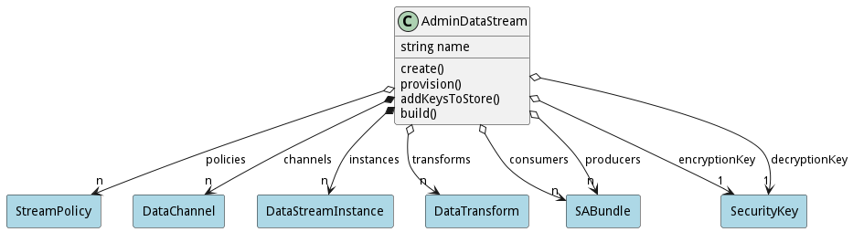

# AdminDataStream

A Data stream defines where I am getting data from or pushing data.

## Attributes

* name:string - Name of the Data Stream

## Associations

| Name | Cardinality | Class | Composition | Owner | Description |
| --- | --- | --- | --- | --- | --- |
| policies | n | StreamPolicy | false | false | This is the collection policies that apply to the stream when the stream is created. |
| channels | n | DataChannel | true | true | This is the collection of channel that are attached to this data stream |
| instances | n | DataStreamInstance | false | true | This is the collection of deployed data streams in the system of this specific data stream. |
| transforms | n | DataTransform |  |  | This is the transformation that is called on data arriving to the Data Stream. |
| consumers | n | SABundle |  |  | This is a consumer of the data stream. |
| producers | n | SABundle |  |  | This is a producer of the data stream. |
| encryptionKey | 1 | SecurityKey |  |  | This is the encryption key for the data stream |
| decryptionKey | 1 | SecurityKey |  |  | This is the decryption key for the data stream |

## Methods
* [create() - Create an AdminTransform](#action-create)
* [provision() - Provision a DataStream creates and instances of the data streamm to be deployed.](#action-provision)
* [addKeysToStore() - Build a Data Stream, generates the security keys for the data stream.](#action-addKeysToStore)
* [build() - Build a Data Stream, generates the security keys for the data stream.](#action-build)

<h2>Method Details</h2>
    
### Action admindatastream create

* REST - admindatastream/create?name=string&amp;file=file
* bin - admindatastream create --name string --file file
* js - admindatastream.create({ name:string,file:file })

#### Description
Create an AdminTransform

#### Parameters

| Name | Type | Required | Description |
|---|---|---|---|
| name | string |true | name of the SAB AdminTransform |
| file | file |false | file with the definition |

### Action admindatastream provision

* REST - admindatastream/provision?bundle=ref&amp;policies=ref
* bin - admindatastream provision --bundle ref --policies ref
* js - admindatastream.provision({ bundle:ref,policies:ref })

#### Description
Provision a DataStream creates and instances of the data streamm to be deployed.

#### Parameters

| Name | Type | Required | Description |
|---|---|---|---|
| bundle | ref |true | Bundle Instance to attach the stream instances. |
| policies | ref |true | Policies to use for deploying the Bundle. |

### Action admindatastream addKeysToStore

* REST - admindatastream/addKeysToStore?keyType=string&amp;store=ref
* bin - admindatastream addKeysToStore --keyType string --store ref
* js - admindatastream.addKeysToStore({ keyType:string,store:ref })

#### Description
Build a Data Stream, generates the security keys for the data stream.

#### Parameters

| Name | Type | Required | Description |
|---|---|---|---|
| keyType | string |true | The type of keys to add to the store encrypt or decrypt |
| store | ref |true |  |

### Action admindatastream build

* REST - admindatastream/build?
* bin - admindatastream build 
* js - admindatastream.build({  })

#### Description
Build a Data Stream, generates the security keys for the data stream.

#### Parameters

No parameters

