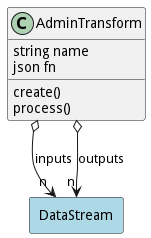

# AdminTransform

Data Transformation taking inputs and producing to outputs.

## Attributes

* name:string - Name of the transformation
* fn:json - Function to run. This should have two parameters. (data,channel)

## Associations

| Name | Cardinality | Class | Composition | Owner | Description |
| --- | --- | --- | --- | --- | --- |
| inputs | n | DataStream |  |  | Inputs of the transformation. |
| outputs | n | DataStream |  |  | Outputs of the transformation. |

## Methods
* [create() - Create an AdminTransform](#action-create)
* [process() - process the admin input stream.](#action-process)

<h2>Method Details</h2>
    
### Action admintransform create

* REST - admintransform/create?name=string&amp;file=file
* bin - admintransform create --name string --file file
* js - admintransform.create({ name:string,file:file })

#### Description
Create an AdminTransform

#### Parameters

| Name | Type | Required | Description |
|---|---|---|---|
| name | string |true | name of the SAB AdminTransform |
| file | file |false | file with the definition |

### Action admintransform process

* REST - admintransform/process?data=ref&amp;properties=json
* bin - admintransform process --data ref --properties json
* js - admintransform.process({ data:ref,properties:json })

#### Description
process the admin input stream.

#### Parameters

| Name | Type | Required | Description |
|---|---|---|---|
| data | ref |true | Policies to use for deploying the Bundle. |
| properties | json |true | Metadata for the data. Contains the heritage of the data. |

