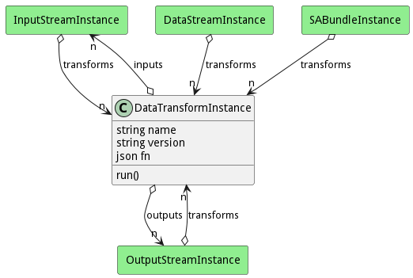

# DataTransformInstance

This represents an instance of a data transformation running in the system.

## Attributes

* name:string - Name of the transformation
* version:string - Version of the transformation
* fn:json - Function to run. This should have two parameters. (data,channel)

## Associations

| Name | Cardinality | Class | Composition | Owner | Description |
| --- | --- | --- | --- | --- | --- |
| inputs | n | InputStreamInstance |  |  | Inputs of the transformation. |
| outputs | n | OutputStreamInstance |  |  | Outputs of the transformation. |

## Users of the Model

| Name | Cardinality | Class | Composition | Owner | Description |
| --- | --- | --- | --- | --- | --- |
| transforms | n | DataStreamInstance |  | false | These are the transforms to run on the stream before it goes to the output streams. |
| transforms | n | SABundleInstance | false | false |  |
| transforms | n | InputStreamInstance |  | false | These are the transforms to run on the stream before it goes to the output streams. |
| transforms | n | OutputStreamInstance |  | false | These are the transforms to run on the stream before it goes to the output streams. |

## Methods

* [run() - Run the transform on the data and update the properties.](#action-run)

<h2>Method Details</h2>
    
### Action datatransforminstance run

* REST - datatransforminstance/run?data=ref&amp;properties=json
* bin - datatransforminstance run --data ref --properties json
* js - datatransforminstance.run({ data:ref,properties:json })

#### Description
Run the transform on the data and update the properties.

#### Parameters

| Name | Type | Required | Description |
|---|---|---|---|
| data | ref |true | Policies to use for deploying the Bundle. |
| properties | json |true | Metadata for the data. Contains the heritage of the data. |

